*This tutorial will guide you through the process of setting up Android Studio, a phone or emulator, and then making sure it is all working by running an app on it. If you are attending an Android workshop at Codebar, we encourage you to work through this tutorial before you come along. If you get stuck, don't worry, just stop where you are and a coach can help you on the day. It is very useful, however, if you can at least download Android Studio before you arrive as it is a big download and the internet can become a problem if too many people try and download it at once.*

## 1. Setting up Android Studio
Android Studio is the IDE you will use for creating Android applications. IDE stands for **I**ntegrated **D**evelopment **E**nvironment, which means it has all the tools you need for development built right into one application. You will use Android Studio in place of your normal text editor (such as Sublime Text or Atom) and use it to build and run your apps on your Android phone.

You first need to [download the installer from this page](https://developer.android.com/studio/index.html). You can then follow the instructions to install Android Studio and the Android SDK. There is a video on [this page](https://developer.android.com/studio/install.html) which will show you the installation process from start to finish.

Once you have finished the installation you will be greeted with this lovely welcome screen!

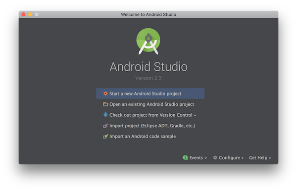

## 2. Creating your first Android project
We are now going to create an Android project within Android Studio. On the welcome screen, press *Start a new Android Studio project*. This will open a window which will ask you for a few things about your new application. Give it a name such as *My First App* and then fill in the company domain box. If you have your own website (such as `adalovelace.co.uk`) you can use that. If not, use something like `yourname.codebar.com`. It doesn't matter if this is a real website, this is just a way for Android to give your app a unique identifier.

> For example, if you have an app called *My First App* and your domain name is `adalovelace.co.uk` then Android will give it a identifier `uk.co.adalovelace.myfirstapp`. This is called the *package name*. As no two apps can have the same package name, this reverse domain system avoids clashes.

You should also choose a location for the project which is where the files will be stored. When you're done, press the next button.

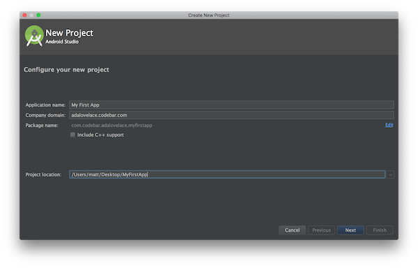

On the next screen you are asked which Android phones you want to support. You can leave that at the default (which in my case is Android 4.4, KitKat). If you are interested, you can click on the *Help me choose* link to see what percentage of users run each version of Android. Make sure only *Phone & tablets* is checked and press *Next*.

> Did you notice that different versions of Android have different names? The third version of Android was called *Cupcake*. The forth version was called *Doughnut*. Every version since has carried on with a "sweet treat" starting with the next letter of the alphabet. You can see a list of all the names [here](https://en.wikipedia.org/wiki/Android_version_history).

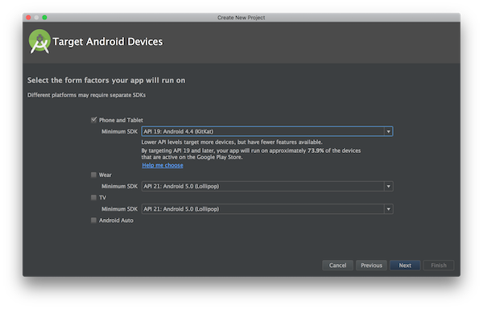

Once the downloads have completed, press *Next* again and then choose the type of *Activity* you want your app to use. An Activity is how Android refers to a screen within apps. Your app can have multiple activities and you can move between them to see different parts of the app. For now, we want to create an app with a *Empty activity*. Make sure that is selected and then press *Next*.

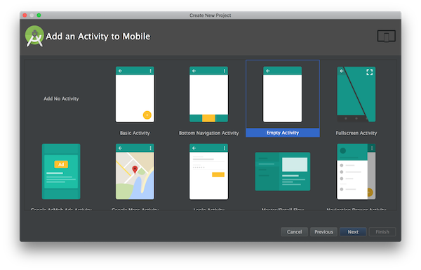

Leave the next screen with all the default options (these are the names of the files Android Studio will create for you) and press *Finish*. In a few seconds the main Android Studio window will open. For now it will look blank, but we will be able to build and run our app from here in a minute.

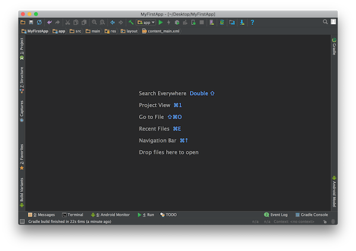

First we need to set up a phone for it to run on.

## 3. Setting up a device or the emulator
Android applications can only be run on an Android phone, but don't worry if you don't have one, you can also run an *emulator* on your computer. An emulator is a program which pretends to be something else. In this case, you can run one through Android Studio which will pretend to be an Android phone. Emulators can be slow, however, so if you have an Android phone follow the steps below to set it up. If you don't, follow the steps to setup the emulator.

### 3.1 Setting up your Android phone
Grab you Android phone and plug it into your computer with a USB cable. If you are using a Windows computer, you might need to install some drivers. You can do that (by following the instructions on this page](https://developer.android.com/studio/run/oem-usb.html).

Now, on your Android phone you need to make sure *USB debugging* is turned on. Go to the phone settings and then scroll down to *About phone*. On this screen, continue to tap on the *Build number* section until it shows a message saying *You are now a developer* (if only it was always that easy!).

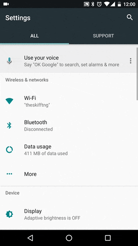

Now you are in developer mode, press back and you should see a new *Developer options* menu. Tap into there and make sure the switch at the top of the screen is turned on. Then scroll down and make sure *USB Debugging* is also turned on.

### 3.1 Setting up the Android emulator
If you don't have an Android phone, you can also set up a emulator to run on your computer.

First, in Android Studio with your project open, Launch the Android Virtual Device Manager by selecting *Tools* > *Android* > *AVD Manager*, or by clicking the AVD Manager icon  in the toolbar. On the screen which opens, press the *Create Virtual Device* button.

On this screen you need to pick which type of device you want to create. Feel free to browse around, but we are going to choose the *Phone* category and then the *Pixel* device. Press *Next*.

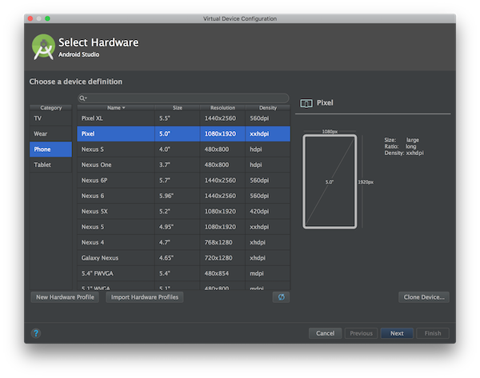

We are now asked to choose which version of Android we want to use. Make sure the recommended tab is selected and then choose any of the options by pressing the *Download* link. You might be asked to accept some terms to continue. Once the download is complete you can press *Finish* to go back to the screen and select that version of Android and press *Next* again.

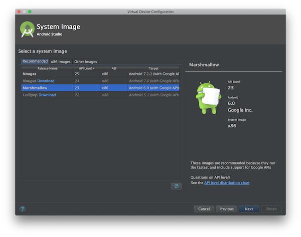

On the next screen leave everything as it is and press *Finish*. This will finish creating the emulator and add it to the list with a name like *Pixel API 23* (your might might be slightly different if you chose a different Android version).

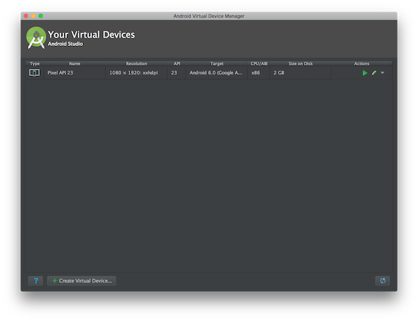

You can now start the emulator by pressing the play button  next to your newly created emulator. It will take a few minutes to start but will eventually show an Android phone in a window on your computer.

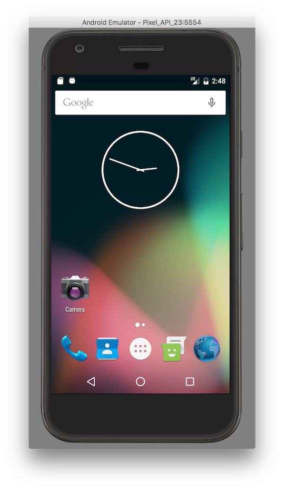

## 4. Running the app on your phone/emulator
We are now going to run your first application to make sure everything is working. All you need to do is press the run button  in the toolbar and then make sure your phone or emulator is selected in the window which pops up.

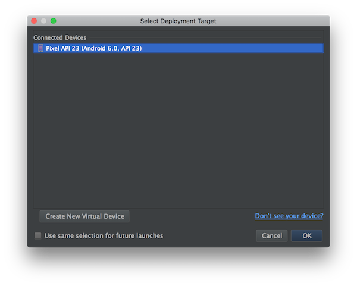

After a short time the app will be built and run on your phone or emulator. It should look like this:

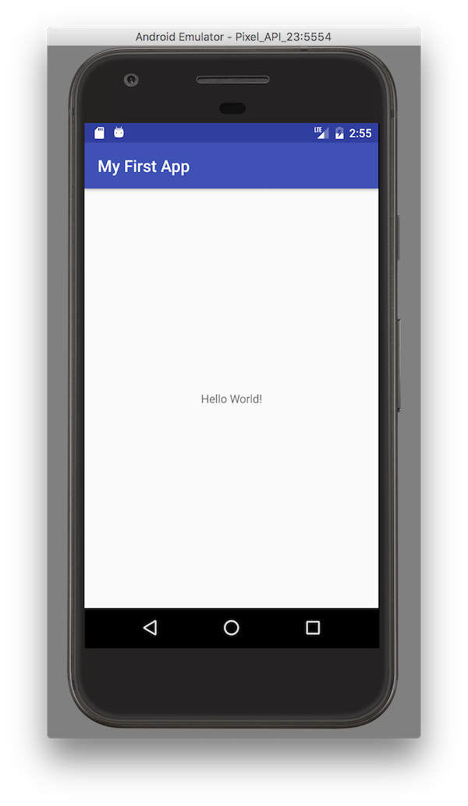

That's it! You're all set up and ready for the [first tutorial](/android/1introduction/tutorial.html)!
