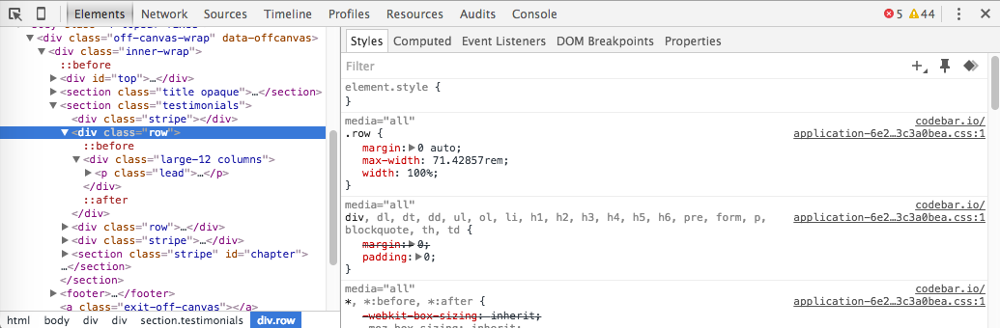
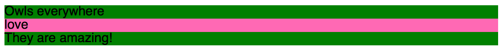
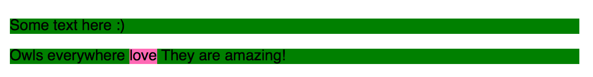
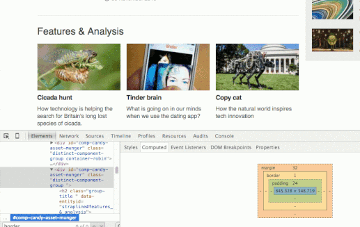

##  HTML AND CSS - Beyond the basics

### Objectives 
 
In this tutorial we are going to look at:
 
* Development Tools
* Structuring content
* Inline vs block elements
* Box model
* :hover state

We will also be explaining in more detail elements that we mentioned in the previous two lessons.
 
### Goal
 
The page we will be building will look similar to this [example page](https://tutorials.codebar.io/html/lesson3/example.html "Ada Lovelace").

### Required files

Download the files required to begin working through the tutorial from [here](https://gist.github.com/despo/7328342/download) or for Windows users if you are having trouble extracting, you can use this [link.](assets/lesson3.zip)

### Recap

In the previous two lessons, we spoke about **H**yper **T**ext **M**arkup **L**anguage and **C**ascading **S**tyle **S**heets. **HTML** defines the _structure_ of a website and **CSS** the _presentation_.


## Development Tools - Inspectors

Inspectors are development tools that help you view, edit and debug CSS, HTML and JavaScript.

Developer Tools are already built into all modern browsers, whether you use [Chrome](https://developer.chrome.com/devtools), [Firefox](https://developer.mozilla.org/en-US/docs/Tools), [Edge](https://docs.microsoft.com/en-us/microsoft-edge/devtools-guide), [Opera](http://www.opera.com/dragonfly/) or [Safari](https://developer.apple.com/library/archive/documentation/AppleApplications/Conceptual/Safari_Developer_Guide/GettingStarted/GettingStarted.html). For advanced users, many other tools are available as browser extensions, including the [Web Developer Toolbar](https://chrispederick.com/work/web-developer/) plugin.



>  Ask your coach to show you how to edit the styling on our example page using developer tools

## Getting started

Let's begin from the head of our page and set the title as we learned in the first lesson.

```html
<title>Ada Lovelace</title>
```

### Structuring content

We will separate our page into three different areas. The **header** will be at the top of our page showing our title and picture. The **container** is where we will specify the main content. And the **footer**.

```html
<header>

</header>
<div>

</div>
<footer>

</footer>
```

> Did you remember to insert these tags within the `<body>` tags of your page?

> Inspect the page. Can you see the title and the elements we just added?

## Inline vs block elements

In CSS there are different ways to [display](https://developer.mozilla.org/en-US/docs/Web/CSS/display "display CSS") elements. The most common ones are: _block_, and _inline_

### block elements

Elements appear on a new line



Some block elements are `<div>, <p>, <h1>, <ul>, <li>`. Most elements are block elements.

### inline elements

Elements appear on the same line



Some inline elements are `, <a>, <em>, <strong>, <span>`

#### To tweak elements and turn them from block, to inline, or the other way around you can use the `display` CSS property with `inline` or `block`


## Setting up the `<header>` content

### Structure

We will develop the page from the top down. You can always come back and tweak things later if you want to.

Add an image wrapped in a `<div>` element

```html
<div>
  
</div>
```

Add the heading `<h1>`, underneath the `<div>` wrapping the image, within the `<header>` element

```html
<div>
  <h1>Hi, I'm Ada Lovelace</h1>
</div>
```

> Load the page. Have a look at how the elements are rendered using the inspector

### Presentation

Let's use what we just learned and make the image an inline element.

Before you can manipulate the `<div>` surrounding the image, you must be able to access it from the stylesheet. Set a class names `my-picture` on that element.

```html
<div class="my-picture">
  
</div>
```

Add the relevant style in your `style.css`

```css
.my-picture {
 display: inline;
}
```

> Have a look at the page. Inspect the image, and have a look at its CSS properties

#### Making this work

Make the `div` element surrounding the heading inline. Start by adding a class `title` to it

```html
<div class="title">
 <h1>Hi, I'm Ada Lovelace</h1>
</div>
```
and then the relevant CSS

```css
.title {
  display: inline-block;
}
```

`inline-block` is another display attribute. You must use `inline-block` rather than `inline` to make the element appear inline because the `div` with the class `title` contains a block element, `<h1>`, that takes over and expands across the end of the line.

> Using devtools, change `inline-block` to `inline` and notice how they render

Adjust the alignment of the `.title`

```css
vertical-align: top;
```

and make the picture a bit smaller

```css
.my-picture img {
  height: 60px;
}
```

## Box model

### What is the box model?

An element can be visualised as a box. The box model is a way of describing the stacking of spatial properties of an element, those which effect it's size &amp; spacing on the page. These are: `padding`, `margin`, `border` as well as `height` and `width`.

**<span style="color: rgb(130,171,182);">blue</span>** represents the values for `height` and `width`. Typically these values are set implicitly based on the content.

**<span style="color: rgb(185,197,124);">green</span>** represents the `padding` &mdash; the space inside the `border`. `padding` adds to the total size of the box. So setting `padding-left: 10px;` and `width: 20px;` would make the element **30px** wide on the page.

**<span style="color: rgb(244,211,139);">yellow</span>** is the `border` &mdash; the edge around the content and `padding`. It can be styled in various ways and represents the outer most visible part of an element.

**<span style="color: rgb(239,195,144);">orange</span>** is the `margin` &mdash; the spacing outside the border. This separates the element from other elements on the page.

Note: `padding`, `margin` and `border` can be applied to any combination of sides. In the example below from the BBC News site, all three are applied, but only above the content.



### Styling the header

Our page is gradually starting to come together. Make `<header>` a bit more distinct by setting a background color and aligning its contents in its center.

```css
header {
  background-color: #fdfdfc;
  text-align: center;
}
```

### Applying box properties to header

Expand the styling of the header so that it has a border and tweak the height and padding

```css
border-bottom: 1px solid #e7e6e6;
padding-top: 14px;
height: 70px;
```

> Do you remember the border properties description from our previous lesson?


> Tweak the width of the border and refresh your page

_border: `thickness` `style` `color`;_

## Setting up the sidebar

Along with `width` and `height`, `min-width`, `max-width`, `min-height`, and `max-height` can be set. These properties tend to be used to ensure that when the page is resized, the browser won't allow for it to be smaller or bigger than the specified property value.

Let's add some content! Add the following inside the `div` in the html file

```html
<div>
  <strong>Me on the internet</strong>
  <ul>
   <li><a href="https://www.facebook.com/augusta.ada.lovelace">facebook</a> </li>
   <li><a href="https://en.wikipedia.org/wiki/Ada_Lovelace">wikipedia</a> </li>
 </ul>
</div>
```

### Styling

Add a class `sidebar` to the div we just defined. This is so that we can change its styling without impacting other elements.

```html
<div class="sidebar">
  <strong>Me on the internet</strong>
  ...
```

Begin by adding a background color so we can clearly see the container

```css
.sidebar {
  background-color: #fdfdfd;
}
```

Restrict the width of the sidebar

```css
width: 30%;
min-width: 300px;
max-width: 320px;
```

Make it an inline-block and set some of its box properties

```css
display: inline-block;
padding: 25px 30px 20px;
border: 1px solid #e8e8ea;
margin-top: 55px;
margin-left: 20px;
```

### Padding and margin
Padding and margin can be set in a number of different ways

`padding: top right bottom left;` e.g. _padding: 10px 20px 30px 5px;_

`padding: top right/left bottom;` e.g. _padding: 10px 20px 5px;_

`padding: top/bottom right/left;` e.g. _padding: 5px 15px;_

`padding: all;` e.g. _padding: 20px_

Alternatively, you can only set the side you want `padding-right: 20px`

_this method also applies to the margin_

###More styling...

Specify a class `.social-media` in the `ul` element

```html
<ul class="social-media">
  <li><a href="https://www.facebook.com/augusta.ada.lovelace">facebook</a> </li>
```

Remove the list bullets and change the default margin and padding of the **u**nordered **l**ist

```css
ul.social-media {
  list-style: none;
  margin-left: 10px;
  padding-left: 20px;
}
```

Add a bottom border, to give the effect of a line, to the individual list items and tweak its dimensions

```css
.social-media li {
  border-bottom: 1px solid #b0afc0;
  padding: 10px;
  width: 200px;
}
```

> Tweak the properties using the inspector.
> What happens when you remove the width or increase the padding?

## Pseudo classes

A pseudo class is a keyword added to selectors that specifies a special state. Using pseudo classes we can specify different styling for different states of a link:

```css
a:link
a:visited
a:hover
a:active
```

Order is **very** important. Always use the order described above if you want to apply different styling for all of the states.
The most commonly used pseudo class for links is `a:hover`. That is what we will use today.

We talk about *pseudo* classes, because in contrast to the classes we address by
putting a dot in front of them, the *pseudo* classes have no actual
correspondent in the HTML. Instead, they refer to a certain state of the element
that is not expressed through the markup.

## Styling links

We only want links that are within the list to be affected. So we will specifically style `.social-media li a`

```css
.social-media li a {
  color: #4c4066;
  text-decoration: none;
  text-shadow: 1px 0px #ffffff;
  border-left: 7px solid #fdcc38;
  padding-left: 10px;
}
```

### Styling link on :hover state

We only want to change the border color when hovering over the link. To avoid repeating ourselves an easy way to do that is by being more specific and using `border-left-color`. Since we have no other borders, we could also use `border-color`

**Remember to have a look [at the list of all CSS properties](https://developer.mozilla.org/en-US/docs/Web/CSS/Reference?redirectlocale=en-US&redirectslug=CSS%2FCSS_Reference) (mentioned in the previous tutorial) when working on styling. There are too many properties to remember!**

```css
.social-media li a:hover {
  border-left-color: #a26cd2;
}
```

## Almost there..

The sidebar is now almost perfect. Tweak a couple of other properties so that the list description is aligned with the other elements and emphasized

```css
.sidebar strong {
  margin-left: 36px;
  color: #4c4066;
  font-size: 19px;
}
```

## Before we continue, some other nice to know box properties...

Add these to the `.sidebar` CSS

```css
border-radius: 6px;
box-shadow: 0 1px 1px 1px rgba(237, 235, 232, 0.4);
```
**border-radius** creates rounded corners

**box-shadow** creates a drop shadow effect allowing us to specify color, size, blur and offset


## Setting up the main container

You've done a great job so far! The sidebar is done and you are familiar with box properties.
Time to add some content to the page.

Add a div, with the class main after `.sidebar`

```html
<div class="main">

</div>
```

Here, we will define the text we want to display about **Ada Lovelace**, using paragraphs to make the content easier to read.

### First, a little bit about her

```html
<p>My name is August Ada King. I'm the Countess of Lovelace.</p>

<p>I am a mathematician and a writer. People know me from my work on Charles Babbage's early mechanical general-purpose computer, the Analytical engine. I wrote the first algorithm intended to be processed by a machine. In other words, I am the world's first programmer.</p>

<p>My mother, Anne Isabella Byron, was a great help to me as she helped me by promoting my interest in mathematics and logic, but I also never forgot about my dad, who moved to Greece when I was just an infant to help out in the civil war.</p>
```

Now that the content is there, we can see that again, we need to tweak the element to display as an inline block and set its width to make sure it appears next to the sidebar.

```css
.main {
  display: inline-block;
  width: 55%;
}
```

> Are the sidebar and container displayed next to each other? What happens when you tweak the width?


Add a bit more space around the main container and set the vertical alignment.

```css
margin-left: 70px;
padding-top: 60px;
vertical-align: top;
```

> Try removing `vertical-align`. What happens?

### Now, focus on the content

Add a link so that anyone coming to the page can easily find out more about Charles Babbage. In the second paragraph, wrap his name in a link as shown below.

```html
<a href="https://en.wikipedia.org/wiki/Charles_Babbage">Charles Babbage's </a>
```

Ada was the world's first programmer therefore we want that to stand out. Add a span around it and specify a class `highlight`, so the intention is obvious and other people working on the code of the page can easily understand it.

```html
<span class="highlight">I am the world's first programmer</span>
```

Set the style for the highlight class

```css
.highlight {
  color: #4c61a9;
}
```

### More content

```html
<blockquote>&ldquo;I do not believe that my father was such a poet as I shall be an Analyst; for with me the two go together indissolubly.&rdquo;</blockquote>

<p>Throughout my life, mathematics have been my primary interest. I always question even basic assumptions by integrating poetry, another great love of mine, and science. I also have a keen interest in scientific developments and trends of my era like phrenology and mesmerism.</p>
```

Being the first paragraph a quote, so we can use `<blockquote>`, as it's more appropriate than a p tag.

```html
<blockquote>&ldquo;I do not believe....</blockquote>
```

and then the styling

```css
blockquote {
  border: 1px solid #E7E6E6;
  padding: 20px 27px;
  border-radius: 6px;
  background-color: #FDFDFC;
  color: #4C4066;
  margin-top: 40px;
  margin-bottom: 40px;
}
```

> Tweak the properties. Explain to your coach what each property does.

A poem about Ada

```html
<p>
 Charles Babbage wrote the following poem about me
 <br/>
 <span>
   Forget this world and all its troubles and if<br/>
   possible its multitudinous Charlatans-every thing<br/>
   in short but the Enchantress of Numbers.
 </span>
</p>
```

> Why do we need a line break (`<br/>`) before the span? What happens when we remove the line break?

Make the poem look different than the rest of the text. Add a CSS class `poem` to the span element and add styling

```css
.poem {
  font-style: italic;
  color: #4C4066;
}
```

### Some more information about Ada
```html
<p>The computer language <a href="https://en.wikipedia.org/wiki/Ada_(programming_language)">Ada</a>, was named after me. The Defense Military standard for the language, MIL-STD-1815 was also given the year of my birth.</p>

<p>These days, the British Computer Society runs an annual competitions for women students of computer science in my name. Also, the annual conference for women undergraduates is named after me. Google also dedicated its <a href="https://www.google.com/doodles/ada-lovelaces-197th-birthday">Google doodle</a> to me, on the 197th anniversary of my birth. </p>

<p>
 <a href="https://www.google.com/doodles/ada-lovelaces-197th-birthday">
  
 </a>
</p>
```

That looks great but we can tweak the position of the doodle so its aligned in the middle and there is a bit more space between it and the page.

Add the class `google-doodle` in the last paragraph and set its styling.

```css
.google-doodle {
  text-align: center;
  margin-top: 90px;
  margin-bottom: 70px;
}
```

### Styling links

Previously, we specified the styling for link elements included within the sidebar. Now we can set a default link style that will be applied to all remaining elements.

```css
a {
  color: #7a3cb7;
}

a:hover {
  color: #a26cd2;
}
```

## Setting up the footer
To complete our page, we will be adding some content and styling the footer

Within the footer, add an attribution to yourself and link to your twitter, Facebook or any other place you want to.

```html
<p>Made by <a href="...">[your name]</a></p>
```

and add the final styling touches for the footer elements

```css
footer {
  height: 60px;
  padding-top: 20px;
  padding-left: 30px;
  background-color: #1f1430;
  border-top: 1px solid #eeeeee;
  margin-top: 20px;
}

footer p {
  color: #b0afc0;
  font-size: 14px;
}

footer a {
  color: #b0afc0;
}
```

> Do you have any questions?

### Bonus - Inspector

Have a look at the [example page](https://tutorials.codebar.io/html/lesson3/example.html "Ada Lovelace"). The heading and body of the page have some differences from the page we just created.

Use the inspector to have a look at `<body>` and `<h1>` and apply these changes to your page.

-----
This ends our third lesson, we hope you enjoyed it and learnt something. If you have some spare time how about going back through this tutorial and, by yourself, make some amendments. If there is something you did not understand or want to give us some feedback, please [send us an email.](mailto:feedback@codebar.io)

