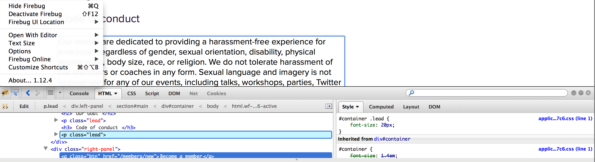
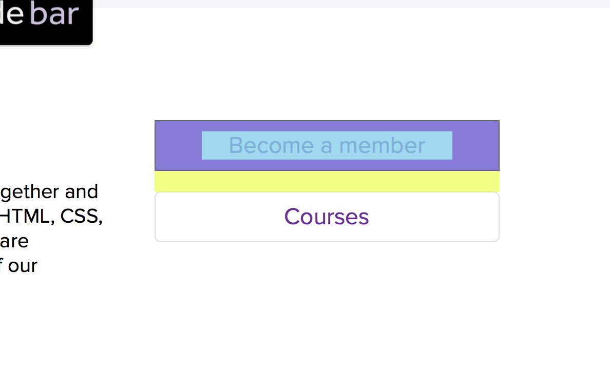

##  HTML AND CSS - Beyond the basics

### Recap

In the previous two lessons, we spoke about **H**yper **T**ext **M**arkup **L**anguage and **C**ascading **S**tyle **S**heets. **HTML** defines the _structure_ of a website and **CSS** the _presentation_.

### Today we will be building a styled website from scratch

The page we will be building will look similar to this [example page]( http://codebar.github.io/tutorials/html/3/example.html "Ada Lovelace")

We will also be explaining in more detail elements that we mentioned in our previous lesson.

## But before we start...

### Required files

Download the files required to start with this tutorial from [here](https://gist.github.com/despo/7328342/download)

### Inspectors

Inspectors are development tools that help you view, edit and debug CSS, HTML and Javascript.

A very popular inspector is [firebug](http://getfirebug.com/), it works nicely on Firefox. Chrome has a build in inspector, but we do suggest you use firebug as it is much easier to use and change different properties with it.



>  Ask your coach to show you how to edit the styling on our example page using firebug

## Getting started

Let's begin from the head of our page and set the title like we learned in the first lesson.

```html
<title>Ada Lovelace</title>
```

## Structuring content

We will separate our page in three different areas. The **header**, where our title and picture, the head of our page, will be, the **container** where we will be specifying the main content, and the **footer**.

```html
<header>

</header>
<div>

</div>
<footer>

</footer>
```

> Did you remember to insert these tags within the <body> of your page?

> Inspect your page. Can you see the title and the elements we just added?

## Inline vs block elements

In css there are two types of ways to display elements: _block_, and _inline_

### block elements

Elements rendered in a new line


Some block elements are `<div>, <p>, <h1>, <ul>, <li>`. Most elements, are block elements.

### inline elements

Elements that appear on the same line


Some inline elements are `, <a>, <em>, <strong>`

#### To tweak elements and turn them from block, to inline, or the other way around you can use the `display` css property with `inline` or `block`


## Setting up the `<header>` content

### Structure

We will develop our page from the top down. You can always come back and tweak things later if you want to.

Start by adding an image wrapped in a `<div>` element

```html
<div>
  
</div>
```

Let's move on to add a title, underneath the `<div>` wrapping the image, within the `<header>` element

```html
<div>
  <h2> Hi, I'm Ada Lovelace</h2>
</div>
```

> Load your page. Have a look at how the elements are rendered.

### Presentation

Let's use what we just learned and make the image an inline element.

But first, to be able to manipulate the `<div>` surrounding the image, we need to be able to access it from out stylesheet. Set a class names `my-picture` on that element.

```html
<div class="my-picture">
  
</div>
```

Add the relevant style in your `style.css`

```css
.my-picture {
 display: inline;
}
```

> Have a look at your page. You can see through the inspector that the image is now set to inline

####Making this work

Make the `div` element surrounding the heading inline. Start by adding a class `title` to it

```html
<div class="title">
 <h1> Hi, I'm Ada Lovelace</h1>
</div>
```
and then the relevant csss

```css
.title {
  display: inline-block;
}
```

`inline-block` is another display attribute. The reason we need to use this, insted of `inline` to make this work is because the `div` with the class `title` contains a block element, `<h1>`, that takes over and expands across the end of the line.

> Switch `inline-block` to `inline` and have a look with firebug

Let's adjust the alignment of the `.title` as well
```css
vertical-align: top;
```

and make our picture a bit smaller

```css
.my-picture img {
  height: 60px;
}
```

##Box model

### What is the box model?

An element, can be considered as a box. The box model tells browsers how the element and its attribtues relate to each other.

Characteristics that define the box model are `padding`, `margin`, `border`, `height` and `width`.

**<span style="color: LightSkyBlue;">blue</span>**, is where `height` and `width` are defined. You don't always need to set this properties, as they will by default be set as the relevant sizing dimensions of the inner content.

**<span style="color: mediumpurple;">purple</span>** is the `padding`; the space between the content and the `border`. The padding also adds to the total width of the box, so if you set `padding: 10px;` and `width: 20px;` your element will be 30px long.

**black** is the `border` - `border` is the edge around the box. It's _thickness_, _style_ and _color_ can be defined.

**<span style="color: gold;'">yellow</span>** is the `margin`, the transparent area around the box, separating it from other elements.

_only the bottom margin is visible in our example. `padding`, `margin` and `border` can be defined for any or all sides of the box._




### Styling the header

Our page is gradually starting to come together. Let's make the header a bit more distinct by setting a background color and aligning its contents in the center of the page.

```css
header {
  background-color: #fdfdfc;
  text-align: center;
}
```

### Applying box properties to header

Expand the styling of the header so that it's viewably separated with a border and tweak the height and padding

```css
  border-bottom: 1px solid #e7e6e6;
  padding-top: 14px;
  height: 70px;
```

> Do you remember the border properties description from our previous lesson?


> Tweak the width of the border and refresh your page

_border: `thickness` `style` `color`;_

## Setting up the main container

Along with `width` and `height` we can also set `min-width`, `max-width`, `min-height` and `max-height`. These properties tend to be used to ensure that when the page is resized, it won't allow for it to be smaller or bigger than the specified property.

Let's add some content to our page. Add the following content inside  the `div` in out html file

```html
<div>
  <b> Me on the internet</b>
  <ul>
   <li><a href="https://www.facebook.com/augusta.ada.lovelace">facebook</a> </li>
   <li><a href="http://en.wikipedia.org/wiki/Ada_Lovelace">wikipedia</a> </li>
 </ul>
</div>
```

### Styling

Add a class to the div we just added to the page, so we can change its styling without impacting other elements.

```html
<div class="sidebar">
  <b> Me on the internet</b>
  ...
```

Start by adding a background color so we can clearly see the container

```css
.sidebar {
  background-color: #fdfdfd;
}
```

We want the sidebar to not take over the entire width of the page

```css
width: 30%;
min-width: 300px;
max-width: 320px;
```

Also, let's make it an inline-block and set some of its box properties

```css
display: inline-block;
padding: 25px 30px 20px;
border: 1px solid #e8e8ea;
margin-top: 55px;
margin-left: 20px;
```

###padding and margin
Padding and margin, can be set in a number of different ways

`padding: top right bottom left;`

`padding: top right/left bottom;`

`padding: top/bottom right/left;`

`padding: all;`

Alternatively, we can only set the side we want `padding-right: 20px`

_this also applies to the margin_

###more styling...

Specify a class `.social-media` in the `ul` element

```html
<ul class="social-media">
  <li><a href="https://www.facebook.com/augusta.ada.lovelace">facebook</a> </li>
```
Remove the list bullets and change the default margin and padding of the **u**nordered **l**ist

```css
ul.social-media {
  list-style:none;
  margin-left: 10px;
  padding-left: 20px;
}
```

Add a bottom border, to give the effect of a line to the individual list items and tweak its dimensions

```
.social-media li {
  border-bottom: 1px solid #b0afc0;
  padding: 10px;
  width: 200px;
}
```

> Tweak the properties and refresh the page.
> What happens when you remove the width or increase the padding?

## Pseudo classes

A pseudo class is a keyword added to selectors that specifies a special state. Using pseudo classes we can specidy different styling for different states of a link

```css
a:link
a:visited
a:hover
a:active
```

Order is **very** important. Always use the order descibed above if you want to style differently for all of the aboce states.
The most commonly used pseudo class for links, that we will also be using today it `a:hover`

## Styling links

We only want links who are within out list to be affected, so we will specifically style `li a`

```css
.social-media li a {
  color: #4c4066;
  text-decoration:none;
  text-shadow: 1px 0px #ffffff;
  border-left: 7px solid #fdcc38;
  padding-left: 10px;
}
```

### Styling link on :hover state

We only want to change the border color when hovering over the link. To avoid repeating ourselves an easy way to do that is by being more specific and using `border-left-color`. Since we have no other borders, we could also use `border-color`

**Remember to have a look [at the list of all CSS properties](https://developer.mozilla.org/en-US/docs/Web/CSS/Reference?redirectlocale=en-US&redirectslug=CSS%2FCSS_Reference) (mentioned in the previous tutorial) when working on styling. The properties are too many to remember!**

```css
.social-media li a:hover {
  border-left-color: #a26cd2;
}
```

## Almost there..

Our sidebar now looks almost perfect. Let's tweak a couple of small things so that the list description is aligned with the other elements and emphasized

```css
.sidebar b {
  margin-left:36px;
  color: #4c4066;
  font-size: 19px;
}
```

## Before we continue, some other nice to know box properties...

Add these to the `.sidebar` css

```css
border-radius: 6px;
box-shadow: 0 1px 1px 1px rgba(237, 235, 232, 0.4);
```
**border-radius** creates rounded corners

**box-shadow** creates a drop shadow effect allowing us to specify color, size, blur and offset


