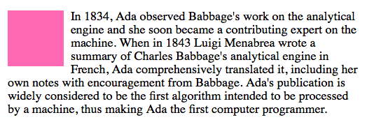
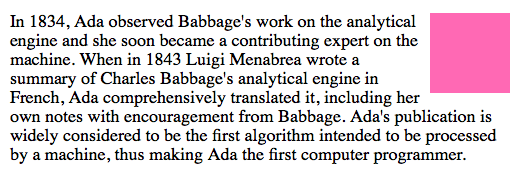

##  HTML AND CSS - CSS, layouts and formatting

### Recap

In the previous lessons, we spoke about **H**yper **T**ext **M**arkup **L**anguage and **C**ascading **S**tyle **S**heets.
**HTML** defines the _structure_ of a website and **CSS** the _presentation_. We also discussed the box model, inline and block elements and pseudo classes.


### Today we will be building a website and learn more about CSS layouts and formatting

The page we will build will look similar to this [example page]( http://codebar.github.io/tutorials/html/lesson4/example.html "Grace Hopper")

## But before we start...

### Required files

Download the files required to begin working through the tutorial from [here](https://gist.github.com/despo/7443914/download)

## Getting started

Define the basic structure of the website

```html
<html>
  <head>

  </head>
  <body>

  </body>
</html>
```

Map the stylesheet to the page

```html
<link rel="stylesheet" href="style.css">
```

Set the title that will be displayed in the browser's bar

```html
<title>Grace Hopper</title>
```

> Did you remember to place the **title** and **stylesheet** in the head of your page?

## Header

Add a header element in the `<body>` of the page

```html
<header>
  <div>
    
  </div>
  <div>
    <h1>Grace Hopper</h1>
  </div>
</header>
```

Before styling the header, reset the default styling of the page. This ensures consistency across different browsers.

```css
body {
  padding: 0;
  margin: 0;
}
```

change the default font family

```css
font-family: Helvetica, Arial, sans-serif;
```

#### Styling the header elements

Center the content of the header, add padding and alignment.

```css
header {
  background-color: #fdfdfc;
  border-bottom: 1px solid #e7e6e6;
  padding-top: 14px;
  text-align: center;
}
```

Set a CSS class `portrait` to the `<div>` wrapping the image

```html
<div class="portrait">
  
  ...
```

and a CSS class `title` to the `<div>` wrapping the heading

```html
<div class="title">
  <h1>Grace Hopper</h1>
  ...
```

Make the `portrait` and the `title` inline elements

```css
.portrait, .title {
  display: inline-block;
}
```

> Did you know that you can define common styles for different CSS classes by comma separating them?


Make the portrait image round, and restrict its height

```css
.portrait img {
  border-radius: 45px;
  height: 85px;
}
```

> Using the inspector, tweak the border radius. What happens when you set it to 20px and 30px?

> Along with the border radius try changing the height. Can you notice the difference when setting height to 100px? What do you have to set the border-radius to, to make the image appear circular?

And finally, add some space between the two elements and make sure the title is aligned to the top of the element it is in.

```css
.portrait {
  padding-bottom: 10px;
}
```

```css
.title {
  margin: 20px 20px 0;
  vertical-align: top;
}
```

Color the `<h1>` so it stands out and is not the same as the other text on the page

```css
.title h1 {
  color: #3D5167;
}
```

## Adding a toolbar

Add some of the resources we used to find out more information about Grace.
This should be placed before the header closing tag.

```html
<div>
  <ul>
    <li> <a href="http://www.personal.psu.edu/djd5202/ass6.html">Computer Scientist</a></li>
    <li> <a href="http://www.youtube.com/watch?v=1-vcErOPofQ">Grace Hopper on Letterman</a></li>
    <li> <a href="http://en.wikipedia.org/wiki/Grace_Hopper">Wikipedia</a></li>
    <li> <a href="http://en.wikiquote.org/wiki/Grace_Hopper">Wikiquote</a></li>
  </ul>
</div>
```

Add an id `toolbar` to the outer `<div>`

### Styling the toolbar

First let's remove the bullet from the list of links

```css
#toolbar ul {
  list-style: none;
  margin: 0;
  padding: 0;
}
```

and make the elements inline so they sit next to each other

```css
#toolbar li {
  display: inline-block;
  padding: 10px;
}
```

and set the colour of the toolbar

```css
background-color: #3D5167;
text-align: center;
```

The text is now really hard to see. Change the color of the link...

```css
#toolbar li a {
  text-decoration: none;
  color: #e7e7e7;
}
```

... and make it underline when you hover your mouse over it.

```css
#toolbar li a:hover {
  border-bottom: 1px solid;
}
```

> Do you remember what **:hover** does? Have a quick look at **Pseudo classes** in the [previous tutorial](http://codebar.github.io/tutorials/html/lesson3/tutorial.html) to refresh your memory.

## Content

Let's add the main content. Paste underneath the header. We will tweak things as we need to along the tutorial.

```html
<div id="content">
  <p>
  <div>
    
    <span>Mark I</span>
  </div>
  Grace Hopper was born in 1906. Her parents, noticing her interest in math, made special arrangements for her to take classes reserved for boys in school. She received a Bachelors deegree in Mathematics and  physics from Vassar college and then moved onto Yale, where she did her Masters deegree in Math. She continued her education and begun a teaching career at Vassar. When she received her PhD she joined the navy, where she was assigned to work in the Bureau of Ordinance computation project at Harvard university. There, she became part of the programming team, who works on the Mark I; the first computer ever made.
  </p>
  <p>
  Her work with the navy and computers did not end until 1966, when she was asked to retire. That didn't last for very long. A couple of months later, she was asked to return to work with COBOL, the first standardised programming language.
  </p>
  <p>
  Throughout her childhood, she had a fascination with both math and the navy. She was able to join the navy after acquiring waivers for the weight and age requirements, and rapidly climbed the ranks. By the time she started working on the Mark I, she was already a lieutenant.
  The demanding environment and high expectations of her at the navy, helped her thrive. This was for her the perfect work environment. She was also the one who wrote the operating manual for the Mark I. In 1949, she left the navy to continue working with computers, and returned back in 1967 to teach young people about them. She loved teaching about computers as much as she loved working with them. Young people for her were the future.
  </p>
  <p>
  <div>
     
     <span>Working with COBOL</span>
  </div>
  Grace loved the Navy, and was reluctant to retire, even at the age of 79. At her retirement ceremony she was recognized for all she contributed, and received the Distinguished Service Medal of the Defense Department, the department's highest honor, and a citation which stated
  <blockquote>
    Rear Admiral Hopper's personal dedication, technical expertise,and broad-based knowledge of the computers were a cornerstone of the navy's continuing development of Information Systems technology. She is one of the Navy's most effective public speakers and a sought-after adviser on the subject of automatic data processing.
  </blockquote>
  </p>
  <p>
  Some of her greatest achievements, were creating the term <b>debug</b>, a term used today to mean fixing the coding errors in a program, by taking a moth out of the Mark I, developing the first compiler, which paved the path to modern computer languages, and creating Flow-Matic, a computer language that recognized 20 English phrases, and interpreted them into machine code.
  </p>
  <p>
  Grace also wrote the first compiler, which enabled a programmer to use words instead of arithmetic, a startling concept for those days. A compiler is now essential in programming languages, and shortens the time it takes to program into days or hours rather then months.
  <br/>
  <em>Her contributions are invaluable.</em>
  </p>
</div>
```

Style the container

```css
#content {
  background-color: #e8e8e8;
  padding: 30px 40px;
}
```

> Before moving forward, spend 5 minutes reading the content. **Grace Hopper** was an amazing woman and her contributions to Computer Science and our world, invaluable.

## Floating elements

Floating elements still keeps them in the normal flow, but as far to the left or right of their container element. Other elements, like paragraphs or lists, wrap around them.

To ensure an element `floats` you must always specify its width, or else it's likely to take over the width of the page and not appear floated.

###Box floating left


###Box floating right


### Floating properties

`float: right` Float to the right of the page

`float: left` Float to the left of the page

`float: inherit` Inherit the value of the parent element

`float: none` Don't float!

Make the two images in the `#content` float

Add a CSS class to the first image's wrapper

```html
<div class="start-of-line">
  
  <span>Mark I</span>
</div>
```

And float the element to the left

```css
.start-of-line {
  float: left;
}
```

Add a CSS class to the second image's wrapper

```html
<div class="end-of-line">
  
  <span>Working with COBOL</span>
</div>
```

And float the element to the right

```css
.end-of-line {
  float: right;
}
```

Add space around the images so there is some separation between them and the text

```css
.start-of-line, .end-of-line {
  padding: 10px;
  height: 200px;
  width: 200px;
}
```

## Positioning

By default, all HTML elements have a position of **static**. This means that they are positioned within the normal flow of the page and ignore any `top`, `bottom`, `right` or `left` properties defined  in the CSS.

Inline boxes flow from left to right and block boxes from top to bottom.

### Relative positioning
When an element's position is defined as relative `position: relative;` it is no longer in the normal flow and it can be moved to the top, right, bottom or left. It can be used in conjunction with `absolute` positioning.

### Absolute positioning
Absolute positioned elements are also outside the normal flow.

Their position is determined by the offset values in the properties `top`, `bottom`, `left` and `right`. These offsets are measured from the element's container block

The container is not necessarily the element it is wrapped in (its parent). To find the container, the browser first looks at the element's parent, then its grandparent, then its great-grandparent and so on, until it finds an ancestor with a `position` of anything other than **static**. If there is no such element, the outer `<html>` is considered its container.


### Using absolute and relative positioning

Add a CSS class `caption` to the description of each of the images

```html
 <span class="caption">The Mark I</span>
 ```

```html
 <span class="caption">Working with COBOL</span>
```

We want this to appear at the bottom of the image, but not under it

First, let's style the `.caption`

```css
.caption {
  background-color: rgba(250, 250, 250, 0.8);
  padding: 5px 10px;
}
```

Now to set the positioning.

Make the `.caption` absolute positioned

```css
position: absolute;
bottom: 10px;
left: 10px;
```

> Refresh the page. Things don't look quite right do they?

Let's fix that!

Set the position of the container elements.
Extend `.start-of-line .end-of-line` and add

```css
position: relative;
```

> Refresh the page again. Does it look a bit better now?

Since we have a width set on the container divs, we can tweak the width of the caption so it takes over the entire bottom of the picture. Add the following to `.caption`

```css
width: 73%;
```

Excellent! We have now managed to use `absolute` and `relative` positioning to do some cool things!

### Footer

Before we do some more cool things, let's add a footer to our page

```html
<footer>
  <p>Made by <a href="http://codebar.io">codebar.io</a></p>
</footer>
```

and style it

```html
footer {
  height: 60px;
  padding-top: 20px;
  background-color: #3D5167;
  border-top: 1px solid #eeeeee;
  width: 100%;
}

footer p {
  color: #b0afc0;
  font-size: 14px;
  margin-left: 30px;
}

footer a {
  color: #b0afc0;
}
```

> Do you understand all the CSS properties we have just applied to the footer and containing elements? Is there something you don't quite remember? Ask your coach to explain.


But we are not quite done yet. The page looks great, but we can do a bit more with it. First let's try and understand another positioning, 'fixed'

### Fixed position
When having a `fixed` position, an element is relative to the viewport of the browser window. As the viewport does not change when the window is scrolled the element always appears to be at the same place. Let's try this out.

Extend `header` and set its position to fixed

```css
position: fixed;
```

> Refresh the page. Notice how the header size has now collapsed to the size of its content?

Fix this by setting the width

```css
width: 100%;
```

And reposition the '#content' so it doesn't hide underneath the header. Change the padding property to have a padding-top

```css
padding: 150px 30px 40px;
```

> Do you remember the padding shortcuts we discussed in the previous lesson? What does the above describe? Can you explain that to your coach?

There is still one small problem with our page. You can view this better if you resize your browser window to fit one third of your screen and scroll down. The images now appear on top of the header. This is due to removing the element from of the normal flow of the page.

### z-index

This can be fixed by changing the `z-index`, which controls how content overlaps.
The element with the highest `z-index` appears on top.

Extend the CSS for the `header`

```
z-index: 99;
```

> Try scrolling again. Don't things look much better now?


## Ending this lesson

Before we finish the lesson, ensure that we have a minimum width set on the page. This way we can make sure that if the page collapses or is viewed in a much smaller screen, the content won't be hidden by the collapsing header.

```css
min-width: 570px;
```

Let's also increase the line height, so that the text of the page is easier to read.

```css
line-height: 23px;
```

-----
This ends our fourth and last lesson in introducing HTML and CSS. Is there something you don't understand? Try and go through the provided resources with your coach. If you have any feedback, or can think of ways to improve this tutorial [send us an email](mailto:feedback@codebar.io) and let us know.
