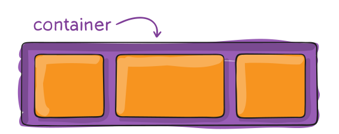
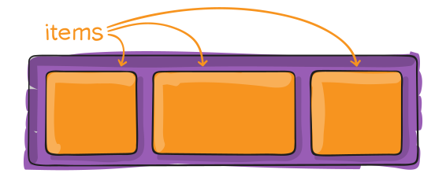
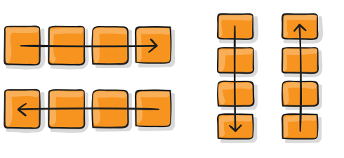
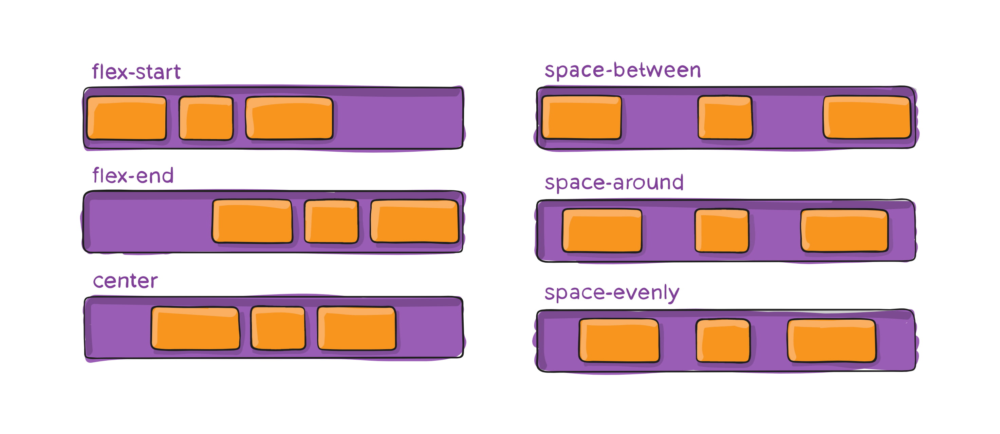
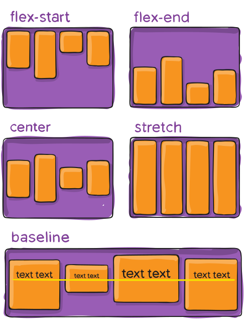
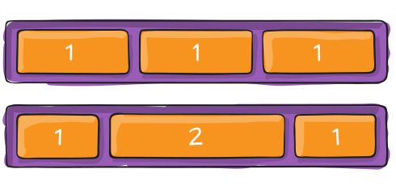
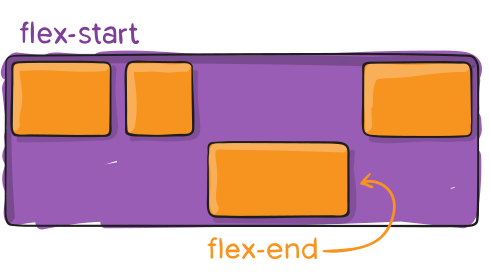
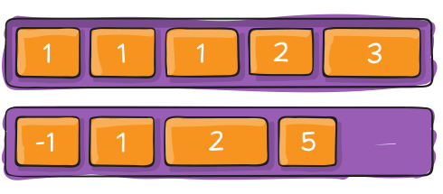

## HTML AND CSS - layouts and formatting

### Objective

Today we will be building a website and learning more about CSS layouts and formatting. We will also be explaining in more detail elements that we mentioned in the previous two lessons.

### Goal

The page we will build will look similar to this [example page](https://tutorials.codebar.io/html/lesson4/example.html "Grace Hopper")

### Required files

Download the files required to begin working through the tutorial from [here.](https://gist.github.com/despo/7443914/download)

### Recap

In the previous lessons, we spoke about **H**yper **T**ext **M**arkup **L**anguage and **C**ascading **S**tyle **S**heets.

**HTML** defines the _structure_ of a website and **CSS** the _presentation_. We also discussed the box model, inline and block elements and pseudo classes.

## Getting started

Define the basic structure of the website

```html
<html>
  <head>

  </head>
  <body>

  </body>
</html>
```

Link the stylesheet to the page

```html
<link rel="stylesheet" href="style.css">
```

Set the title that will be displayed in the browser's bar

```html
<title>Grace Hopper</title>
```

> Did you remember to place the **title** and **stylesheet** in the head of your page?

## Header

Add a header element in the `<body>` of the page

```html
<header>
  <div>
    
  </div>
  <div>
    <h1>Grace Hopper</h1>
  </div>
</header>
```

Before styling the header, reset the default styling of the page. This ensures consistency across different browsers.

```css
body {
  padding: 0;
  margin: 0;
}
```

change the default font family

```css
font-family: Helvetica, Arial, sans-serif;
```

#### Styling the header elements

Center the content of the header, add padding and alignment.

```css
header {
  background-color: #fdfdfc;
  border-bottom: 1px solid #e7e6e6;
  padding-top: 14px;
  text-align: center;
}
```

Set a CSS class `portrait` to the `<div>` wrapping the image

```html
<div class="portrait">
  
  ...
```

and a CSS class `title` to the `<div>` wrapping the heading

```html
<div class="title">
  <h1>Grace Hopper</h1>
  ...
```

Make the `portrait` and the `title` inline elements

```css
.portrait, .title {
  display: inline-block;
}
```

> Did you know that you can define common styles for different CSS classes by comma separating them?


Make the portrait image round, and restrict its height

```css
.portrait img {
  border-radius: 45px;
  height: 85px;
}
```

> Using the inspector, tweak the border radius. What happens when you set it to 20px and 30px?

> Along with the border radius try changing the height. Can you notice the difference when setting height to 100px? What do you have to set the border-radius to, to make the image appear circular?

And finally, add some space between the two elements and make sure the title is aligned to the top of the element it is in.

```css
.portrait {
  padding-bottom: 10px;
}
```

```css
.title {
  margin: 20px 20px 0;
  vertical-align: top;
}
```

Color the `<h1>` so it stands out and is not the same as the other text on the page

```css
.title h1 {
  color: #3D5167;
}
```

## Adding a toolbar

Add some of the resources we used to find out more information about Grace.
This should be placed before the header closing tag.

```html
<div>
  <ul>
    <li> <a href="http://www.cs.yale.edu/homes/tap/Files/hopper-story.html">Computer Scientist</a></li>
    <li> <a href="https://www.youtube.com/watch?v=1-vcErOPofQ">Grace Hopper on Letterman</a></li>
    <li> <a href="https://en.wikipedia.org/wiki/Grace_Hopper">Wikipedia</a></li>
    <li> <a href="https://en.wikiquote.org/wiki/Grace_Hopper">Wikiquote</a></li>
  </ul>
</div>
```

Add an id `toolbar` to the outer `<div>`

See what happens when you add a `target="_blank"` to your link

```html
  <li> <a href="http://www.cs.yale.edu/homes/tap/Files/hopper-story.html" target="_blank">Computer Scientist</a></li>
```

### Styling the toolbar

First let's remove the bullet from the list of links

```css
#toolbar ul {
  list-style: none;
  margin: 0;
  padding: 0;
}
```

and make the elements inline so they sit next to each other

```css
#toolbar li {
  display: inline-block;
  padding: 10px;
}
```

and set the colour of the toolbar

```css
background-color: #3D5167;
text-align: center;
```

The text is now really hard to see. Change the color of the link...

```css
#toolbar li a {
  text-decoration: none;
  color: #e7e7e7;
}
```

... and make it underline when you hover your mouse over it.

```css
#toolbar li a:hover {
  border-bottom: 1px solid;
}
```

> Do you remember what **:hover** does? Have a quick look at **Pseudo classes** in the [previous tutorial](https://tutorials.codebar.io/html/lesson3/tutorial.html) to refresh your memory.

## Content

Let's add the main content. Paste underneath the header. We will tweak things as we need to along the tutorial.

```html
<div id="content">
  <div>
    
    <span>Mark I</span>
  </div>
  <p>
  Grace Hopper was born in 1906. Her parents, noticing her interest in math, made special arrangements for her to take classes reserved for boys in school. She received a Bachelors deegree in Mathematics and  physics from Vassar college and then moved onto Yale, where she did her Masters deegree in Math. She continued her education and begun a teaching career at Vassar. When she received her PhD she joined the navy, where she was assigned to work in the Bureau of Ordinance computation project at Harvard university. There, she became part of the programming team, who works on the Mark I; the first computer ever made.
  </p>
  <p>
  Her work with the navy and computers did not end until 1966, when she was asked to retire. That didn't last for very long. A couple of months later, she was asked to return to work with COBOL, the first standardised programming language.
  </p>
  <p>
  Throughout her childhood, she had a fascination with both math and the navy. She was able to join the navy after acquiring waivers for the weight and age requirements, and rapidly climbed the ranks. By the time she started working on the Mark I, she was already a lieutenant.
  The demanding environment and high expectations of her at the navy, helped her thrive. This was for her the perfect work environment. She was also the one who wrote the operating manual for the Mark I. In 1949, she left the navy to continue working with computers, and returned back in 1967 to teach young people about them. She loved teaching about computers as much as she loved working with them. Young people for her were the future.
  </p>
  <div>
     
     <span>Working with COBOL</span>
  </div>
  <p>
  Grace loved the Navy, and was reluctant to retire, even at the age of 79. At her retirement ceremony she was recognized for all she contributed, and received the Distinguished Service Medal of the Defense Department, the department's highest honor, and a citation which stated
  <blockquote>
    Rear Admiral Hopper's personal dedication, technical expertise,and broad-based knowledge of the computers were a cornerstone of the navy's continuing development of Information Systems technology. She is one of the Navy's most effective public speakers and a sought-after adviser on the subject of automatic data processing.
  </blockquote>
  </p>
  <p>
  Some of her greatest achievements, were creating the term <b>debug</b>, a term used today to mean fixing the coding errors in a program, by taking a moth out of the Mark I, developing the first compiler, which paved the path to modern computer languages, and creating Flow-Matic, a computer language that recognized 20 English phrases, and interpreted them into machine code.
  </p>
  <p>
  Grace also wrote the first compiler, which enabled a programmer to use words instead of arithmetic, a startling concept for those days. A compiler is now essential in programming languages, and shortens the time it takes to program into days or hours rather then months.
  <br/>
  <em>Her contributions are invaluable.</em>
  </p>
</div>
```

Style the container

```css
#content {
  background-color: #e8e8e8;
  padding: 30px 40px;
}
```

> Before moving forward, spend 5 minutes reading the content. **Grace Hopper** was an amazing woman and her contributions to Computer Science and our world are invaluable.

## Floating elements

Floating elements still keeps them in the normal flow, but as far to the left or right of their container element. Other elements, like paragraphs or lists, wrap around them.

To ensure an element `floats` you must always specify its width, or else it's likely to take over the width of the page and not appear floated.

### Box floating left


### Box floating right


### Floating properties

`float: right` Float to the right of the page

`float: left` Float to the left of the page

`float: inherit` Inherit the value of the parent element

`float: none` Don't float!

Make the two images in the `#content` float

Add a CSS class to the first image's wrapper

```html
<div class="start-of-line">
  
  <span>Mark I</span>
</div>
```

And float the element to the left

```css
.start-of-line {
  float: left;
}
```

Add a CSS class to the second image's wrapper

```html
<div class="end-of-line">
  
  <span>Working with COBOL</span>
</div>
```

And float the element to the right

```css
.end-of-line {
  float: right;
}
```

Add space around the images so there is some separation between them and the text

```css
.start-of-line, .end-of-line {
  padding: 10px;
  height: 200px;
  width: 200px;
}
```

## Flexible Box Layout

It is a CSS module that defines a set of properties for positioning, aligning, and distributing space between elements in a container, even if their size is unknown or dynamic.

The basic idea is to separate items into a block container (`flex container`) and its children (`flex items`).





A Flexbox container can change the width and height of its children, as well as the direction of their arrangement - alignment in a column or line, the order in which elements are displayed and the distance between them. A container expands elements to best fit the available space, or shrinks them to prevent overflow.

> In a flex container, most of the rules for arranging elements according to their type and document flow are overridden.

> Elements lose their "type", stop being inline or block.
> Block elements no longer go vertically under each other.
> Margins at the junction with the border of the parent do not fall out.
> Elements' vertical padding does not collapse.
> Automatic vertical indents work.

### Terminology

The normal order of elements is determined by the document flow and their type (block or inline). In the Flexbox model, the direction in which items are laid out is determined by the direction axes of the container, along which the items line up.

- **main axis** - the main axis of the flex container, along which the elements are located. It doesn't have to be horizontal, its direction is controlled by the `flex-direction` property.
- **main-start** and main-end - elements in a container are always located from `main-start` (the start of the main axis) to `main-end` (the end of the main axis).
- **cross axis** - the cross axis, which is always perpendicular to the main axis. Its direction depends on the main axis and is not explicitly set.
- **cross-start** and cross-end - the beginning and end of the transverse axis along which the lines of the element are located

### Container Properties

A flex `container` is the parent of a group of elements that need to be reordered. It is the container properties that control the direction of the axes, multiline and positioning of elements in the line.


#### `display` property

```css
display: flex | inline-flex;
```

Creates a flex container, block or inline-block, depending on the given value, and sets the flex context for all children (not descendants) of the container, turning them into flex items.

```html
<ul class="menu">
  <li class="item"><a href="" class="link">Home</a></li>
  <li class="item"><a href="" class="link">Blog</a></li>
  <li class="item"><a href="" class="link">Podcasts</a></li>
  <li class="item"><a href="" class="link">Contacts</a></li>
</ul>
```

Let's create a horizontal menu by turning `ul.menu` into a flex container. Then its children, `li.item` elements, will be located along the main axis, which by default goes from left to right.

```css
.menu {
  display: flex;
}
```

The flex container `ul.menu` has no effect on `a.link` inside the list items, because they are its children, not children. It is the children that become flex items, in our case, the `li.item` elements.

#### `flex-direction` property

Flexbox is a system for laying out elements in one specific direction - either horizontally or vertically. The `flex-direction` property sets the direction of the main axis, defining the direction of the elements in the container.

```css
flex-direction: row | row-reverse | column | column-reverse;
```

- `row` - the axis starts on the left and ends on the right. This is the default value.
- `row-reverse` - the axis starts on the right and ends on the left.
- `column` - the main axis becomes vertical, starting at the top and ending at the bottom.
- `column-reverse` - the main axis becomes vertical, starting at the bottom and ending at the top.

  

By default, `flex-direction` is set to `row`, so the top menu items start lining up from left to right. The bottom menu is set to `row-reverse`, the main axis is reversed 180 degrees, and the items line up from right to left.

#### `justify-content` property

Controls the positioning of elements on the main axis, from `main-start` to `main-end`.

```css
justify-content: flex-start | flex-end | center | space-between | space-around |
  space-evenly;
```

- `flex-start` - items are pressed to the start of the axis. This is the default value.
- `flex-end` - elements are pressed to the end of the axis.
- `center` - elements are centered on the axis.
- `space-between` - elements are evenly distributed on the main axis. The first element is set to the beginning of the axis, and the last element to the end.
- `space-around` - elements are distributed evenly, but the left and right elements lag behind the container borders by half the gap between the other elements.
- `space-evenly` - the elements are distributed so that the distance between the elements, and from the outermost elements to the borders of the container, is the same

  

The most commonly used values, including the default value, are shown in the example. These include shifting content to the right (`flex-end`), centering (`center`), and evenly distributing space between elements (`space-between`).

#### `align-items` property

Controls the arrangement of elements along the transverse axis. This is the equivalent of `justify-content` for the main axis.

```css
align-items: stretch | flex-start | flex-end | center | baseline;
```

- `stretch` - elements are stretched to the full length of the axis. This is the default value.
- `flex-start` - elements are pressed to the start of the axis.
- `flex-end` - elements are pressed against the end of the axis.
- `center` - elements are centered on the axis.
- `baseline` - elements are aligned to the baseline of their text content.



Probably the most common use is to vertically center elements in a row, especially if the elements are of different heights. Let's add a header with a logo to our markup and nest the menu in the header so that the logo and the menu are neighbors.

```html
<header class="page-header">
  <a href="" class="logo">Logo</a>

  <ul class="menu">
    <li class="item"><a href="" class="link">Home</a></li>
    <li class="item"><a href="" class="link">Blog</a></li>
    <li class="item"><a href="" class="link">Podcasts</a></li>
    <li class="item"><a href="" class="link">Contacts</a></li>
  </ul>
</header>
```

The first thing to do is to put the `a.logo` logo and the `ul.menu` menu in the line, for this we turn the `header.page-header` into a flex container.

```css
.page-header {
  display: flex;
}
```

The menu is taller than the logo (with all the styles from the example), so it stretches vertically to the full length of the cross axis, due to the default `align-items` set to `stretch`. To fix this and align the logo and menu vertically to the center, set the value to `center`.

```css
.page-header {
  display: flex;
  align-items: center;
}
```

The last step is to move the logo and menu to the corners of the header by setting `justify-content` to `space-between`. Since there are only two elements in the line (logo and menu), they are pressed against the edges of the main axis, and all the free space is between them.

```css
.page-header {
  display: flex;
  align-items: center;
  justify-content: space-between;
}
```

### Item Properties

Flex items are the children of the flex container, the first level of nesting. Flex-elements cease to obey the standard flow of the document, lose their type (block, inline, etc.) and follow the rules of the Flexbox positioning model.


#### `flex-basis` property

Specifies the initial size of the element before allocating free space. The value can be any valid value: pixels, percentages, rem, etc. For flex items, this is a replacement for the `width` property, but with some peculiarities. In the examples in this lesson, `flex-basis` was set for all flex items, not `width`.

```css
flex-basis: auto | значение;
```

- If both `flex-basis` and `width` are specified, then the `width` property is ignored.
- The `flex-basis` property is not the final size of the element, but the size before the free space is allocated.
- The `min-width` and `max-width` properties work as constraints on the size of an element, even if it has `flex-basis` and not `width`.
- The `flex-basis` property can define the height rather than the width of an element. This happens when the main axis is vertical.

#### `flex-grow` property

Determines the ability of an element to take up more space (grow) as needed than its initial size. The value is specified as a proportion (share) of free space in the container.s

```css
flex-grow: share;
```

By default, all elements are set to `0`, which means that elements do not try to take up additional free space, even if there is one. Negative values cannot be specified.



For example, if all elements have the same value for this property, they will take up the same amount of space in the container. But if you set everything to `1`, and one element to `2`, then it will try to take up twice as much space as any other element.

#### `flex-shrink` property

Specifies the ability of an element to take up less space (shrink) as needed than its initial size. The value is given as a proportion (share).

```css
flex-shrink: share;
```

By default, all elements are set to `1`, which means that elements will shrink when necessary. Negative values cannot be specified. Used quite rarely.

#### `align-self` property

Allows an element to change its position on the cross axis by overriding the value of the container's `align-items` property for itself. There is no analogue for the main axis, the element can only move itself on the transverse axis.

```css
align-self: auto | flex-start | flex-end | center | baseline | stretch;
```



#### `order` property

```css
# By default, all elements are set to 0
order: position;
```

This property is not often used, due to the fact that it breaks the relationship between the visual order of elements and how the browser and assistive technologies see them.



### Useful Links

- [Flexbox Playground](https://flexbox.tech/)
- [Flexbox froggy game](https://flexboxfroggy.com/)

## Positioning

By default, all HTML elements have a position of **static**. This means that they are positioned within the normal flow of the page and ignore any `top`, `bottom`, `right` or `left` properties defined  in the CSS.

Inline boxes flow from left to right and block boxes from top to bottom.

### Relative positioning
When an element's position is defined as relative `position: relative;` it is no longer in the normal flow and it can be moved to the top, right, bottom or left. It can be used in conjunction with `absolute` positioning.

### Absolute positioning
Absolute positioned elements are also outside the normal flow.

Their position is determined by the offset values in the properties `top`, `bottom`, `left` and `right`. These offsets are measured from the element's container block

The container is not necessarily the element it is wrapped in (its parent). To find the container, the browser first looks at the element's parent, then its grandparent, then its great-grandparent and so on, until it finds an ancestor with a `position` of anything other than **static**. If there is no such element, the outer `<html>` is considered its container.


### Using absolute and relative positioning

Add a CSS class `caption` to the description of each of the images. The first one:

```html
 <span class="caption">Mark I</span>
```

And the second:

```html
 <span class="caption">Working with COBOL</span>
```

We want this to appear at the bottom of the image, but not under it

First, let's style the `.caption`

```css
.caption {
  background-color: rgba(250, 250, 250, 0.8);
  padding: 5px 10px;
}
```

Now to set the positioning.

Make the `.caption` absolute positioned

```css
position: absolute;
bottom: 10px;
left: 10px;
```

> Refresh the page. Things don't look quite right do they?

Let's fix that!

Set the position of the container elements.
Extend `.start-of-line .end-of-line` and add

```css
position: relative;
```

> Refresh the page again. Does it look a bit better now?

Since we have a width set on the container divs, we can tweak the width of the caption so it takes over the entire bottom of the picture. Add the following to `.caption`

```css
width: 73%;
```

Excellent! We have now managed to use `absolute` and `relative` positioning to do some cool things!

### Footer

Before we do some more cool things, let's add a footer to our page

```html
<footer>
  <p>Made by <a href="https://codebar.io/">codebar.io</a></p>
</footer>
```

and style it

```css
footer {
  height: 60px;
  padding-top: 20px;
  background-color: #3D5167;
  border-top: 1px solid #eeeeee;
  width: 100%;
}

footer p {
  color: #b0afc0;
  font-size: 14px;
  margin-left: 30px;
}

footer a {
  color: #b0afc0;
}
```

> Do you understand all the CSS properties we have just applied to the footer and containing elements? Is there something you don't quite remember? Ask your coach to explain.


But we are not quite done yet. The page looks great, but we can do a bit more with it. First let's try and understand another positioning, 'fixed'

### Fixed position
When having a `fixed` position, an element is relative to the viewport of the browser window. As the viewport does not change when the window is scrolled the element always appears to be at the same place. Let's try this out.

Extend `header` and set its position to fixed

```css
position: fixed;
```

> Refresh the page. Notice how the header size has now collapsed to the size of its content?

Fix this by setting the width

```css
width: 100%;
```

And reposition the `#content` so it doesn't hide underneath the header. Change the padding property to have a padding-top

```css
padding: 160px 30px 40px;
```

> Do you remember the padding shortcuts we discussed in the previous lesson? What does the above describe? Can you explain that to your coach?

There is still one small problem with our page. You can view this better if you resize your browser window to fit one third of your screen and scroll down. The images now appear on top of the header. This is due to removing the element from of the normal flow of the page.

### z-index

This can be fixed by changing the `z-index`, which controls how content overlaps.
The element with the highest `z-index` appears on top.

Extend the CSS for the `header`

```
z-index: 99;
```

> Try scrolling again. Don't things look much better now?


## Ending this lesson

Before we finish the lesson, ensure that we have a minimum width set on the page. This way we can make sure that if the page collapses or is viewed using a much smaller screen, the content won't be hidden by the collapsing header.

```css
min-width: 570px;
```

Let's also increase the line height, so that the text of the page is easier to read.

```css
line-height: 23px;
```

-----
This ends our fourth lesson, we hope you enjoyed it and learnt something. If you have some spare time how about going back through this tutorial and, by yourself, make some amendments. If there is something you did not understand or want to give us some feedback please [send us an email.](mailto:feedback@codebar.io)

## Further reading

* [Learn layout](http://learnlayout.com/)
