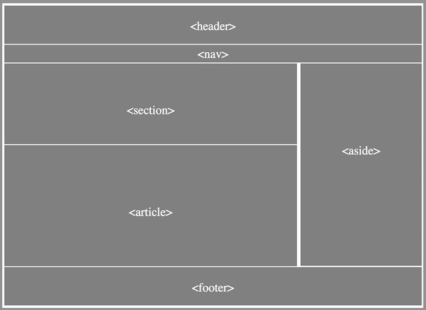
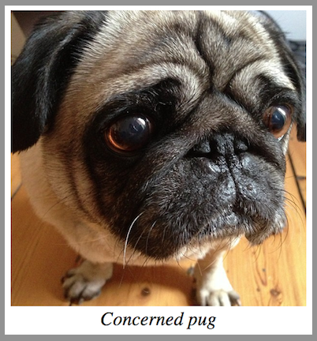

## HTML AND CSS - Advanced HTML5

### Objective
 
Today we will be focusing more on HTML5.

### Goal

Build a website with little guidance. Remember you can look back on all of the previous tutorials and use inspect element. It should be your best friend when developing for the web.

### Recap

In the last lesson, we introduced you to even more **HTML5** and **CSS3**.

## HTML5 structural semantics

## Sectioning

We used some HTML5 elements in previous lessons, including `<header>`, `<footer>`, and `<section>`. HTML5 introduced many other new elements. Some common ones include `<nav>`, `<article>`, and `<main>`.



These elements don't change how our website *looks*. They let us describe the *structure* of our page. This gives more information to the user's browser, and helps out assistive programs (such as screen readers, commonly used by blind people). We can still use CSS to change the style of these elements, just like we did with `<div>`s in previous tutorials.

### `<section>`
A section is usually a "blob" of content. When you are considering using it, ask yourself if your potential `<section>` has a natural heading. If not, it might not be the right choice.

If you just want to style a part of the page, a `<div>` would be more appropriate.


## `<article>`

An `<article>` should make sense as a self-contained document. For instance, it could be a forum post, a magazine or newspaper article, a blog entry, a user-submitted comment, or any other independent item of contant. You can use `<header>` and `<footer>` tags within your `<article>`s too.

## `<aside>`

An `<aside>` is something related to but separate to the current containing element. For instance, if your page displayed bits of blog posts, an `<aside>` might contain a list of posts, or adverts related to the main content. Or maybe your page is a blog article - in that case, you could use an `<aside>` to contain a sidenote.


## Other elements

### `<address>`

The `<address>` element is used to provide contact information related to the page. It's mainly meant for details like postal addresses and telephone numbers, but you can include email addresses and links to online contact methods too. Here's an example:

```html
<address>
  Mr. Jack Random<br>
  HTML5 street,<br>
  The internets,<br>
  Word Wide Web,<br>
  Tel: +44 (0) xxx xxx
</address>
```

### `<figure>` and `<figcaption>`

We've already seen that we can put images in our page using the `` tag, but we often want to include a caption for our images.
`<figure>` can be used in conjunction with the `<figcaption>` element to describe images, pictures, illustrations and diagrams (and even more).

```html
<figure>
 
 <figcaption>
  Concerned pug
 </figcaption>
</figure>
```


### `<video>` and `<audio>`
In the old days, before HTML5, you had to use a plug-in if you wanted to include videos and audio in your page. These weren't supported in all browsers, and often didn't work at all on smart phones. These days, we can use the `<video>` and `<audio>` elements to play media directly in the browser and embed them in our documents.

Some browsers still don't support this. In that case, the browser will show the message you include within the tag. Here's a video example:

```html
<video src="path/to/video" controls>
  Your browser doesn't support embedded video!
</video>
```

We can use other attributes to control our media plays. To make music start playing automatically, you use the **autoplay** attribute. To make the controls visible, use the **controls** attribute. Without this, you wouldn't see your audio player!

```html
<audio src="path/to/music.mp3" controls="controls" autoplay="autoplay">
  Your browser doesn't support embedded audio!
</audio>
```

## Getting started with our page

Today, we will be following a different approach to building our page.

You now know enough to build a complete web page from scratch. Open [our example page](https://tutorials.codebar.io/html/lesson6/index.html "Women in Programming"), then try to build it yourself. You should use the HTML5 elements we mentioned today and what you have learned in the previous tutorials.

### But before you begin...

Download the files required to begin working through the tutorial from [here](https://gist.github.com/despo/7680133/download). Create a new folder on your computer for this tutorial, and extract the downloaded archive in that folder.


### Links and resources you will need

```
Hi I'm Ada Lovelace - https://tutorials.codebar.io/html/lesson3/example.html
Grace Hopper - https://tutorials.codebar.io/html/lesson4/example.html
Anita Borg - Where are we and where are we going. - https://tutorials.codebar.io/html/lesson5/example.html
Grace Hopper on Letterman - https://tutorials.codebar.io/html/lesson6/assets/images/grace-letterman.mp4

```

Also, don't forget to refer to the [previous tutorials](https://tutorials.codebar.io/)

> Don't be afraid to ask for help from your coach.

> Build a basic version first, then try to make it more fancy. Don't try to make it perfect first time.

> Remember to use your browser inspector! It can help you find out why things aren't working. Try not to use it to peek at how the example was built, though. :)

> If your video doesn't play, try using Chrome. There's a known issue with Firefox's video playback.

## CSS Bonus

You can rotate elements using CSS:

```css
img {
  transform: rotate(20deg);
}
```


-----
This ends our sixth lesson. How did you find learning HTML and CSS? If you have some spare time how about going back through this tutorial and, by yourself, make some amendments. If there is something you did not understand or want to give us some feedback please [send us an email.](mailto:feedback@codebar.io)

## Extras

Now that you are familiar with HTML & CSS, how about you create your own portfolio site. Think about the pages that you may include, such as home, about me and a portfolio or gallery page. You may even want to include a downloadable CV.

## Further Reading:
### Accessibility

Some of your users might be using screenreaders or keyboards to navigate across your page. How do you ensure your website is available to them? By following a few guidelines and integrating particular techniques.

#### Acronyms to know:
- (ARIA) Accessible Rich Internet Applications are set of techniques and additions to HTML to allow additional markup to be interpreted by accessibility devices.
- (WCAG) Website Content Accessibility Guidelines contain different compliance levels (A, AA and AAA) and lay down the “rules” to make a website or application accessible.
- (WAI) The Web Accessibility Initiative is a part of the W3 consortium that works on accessibility standards, guidelines, rules and techniques.
- (a11y or A11Y) is an abbreviation/numeronym for accessibility. The number 11 refers to the number of letters omitted.

#### Articles for getting started with accessibility:
- [Introduction to Accessibility](https://www.w3.org/standards/webdesign/accessibility)
- [WAI Getting started](https://www.w3.org/WAI/fundamentals/accessibility-intro/)
- [How People with disabilities use the web](https://www.w3.org/WAI/people-use-web/)
- [Tutorials](https://www.w3.org/WAI/tutorials/)
- [Mozilla have created their own Accessibility page](https://developer.mozilla.org/en-US/docs/Web/Accessibility/ARIA)
- [ARIA Techniques for WCAG 2.0](https://www.w3.org/TR/WCAG20-TECHS/aria)
- The [A11Y Project](https://a11yproject.com/) is an open source project on providing the most up to date and easy to access information regarding accessibility.

#### These extensions are handy if you wish to check if your website meets the criteria and areas to improve:
- Chrome: WAVE Evaluation Tool
- Firefox:[AInspector](https://addons.mozilla.org/en-US/firefox/addon/ainspector-sidebar/)
