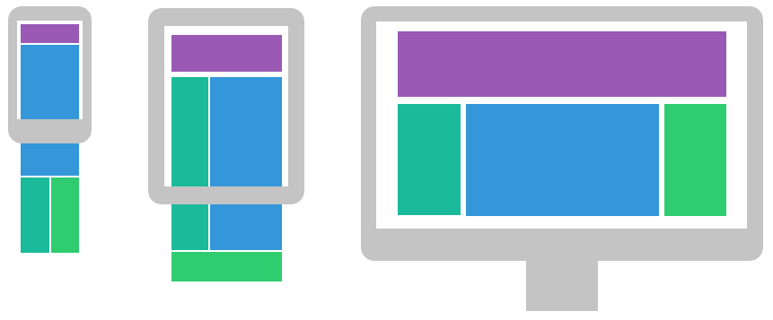
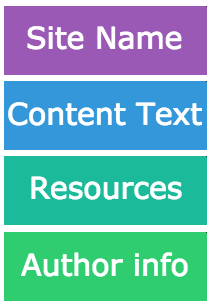
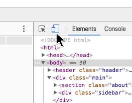
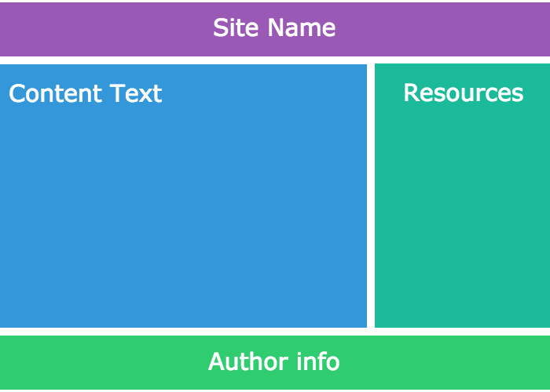

## Responsive layouts and Media Queries

### Objective

Today we will be building a responsive website and learning about CSS media queries.

### Goal

The page we will build will look similar to this [example page]( https://tutorials.codebar.io/html/lesson7/example.html "Grace Hopper")

### Required files

Download the files required to begin working through the tutorial from [here.](https://gist.github.com/thisisjofrank/ca419fd5c63ee5ed5b1ac0b4ade168f6/download)

### Recap

In the previous lessons, we spoke about **HTML5** elements which are used to put content on the page, and **CSS** which we use to style the content.

### Getting started

Responsive web design is an approach that suggests that design and development should respond to their environment.

Usually, this takes the form of a design that is optimised for the width of the viewport (the width of the device that the user is looking at, be it a mobile, tablet or monitor, or even a watch!)

We're going to create a responsive layout that adapts to the viewport width using media queries.

Lets get started. Create an index.html file and mark it up.

    <html>
        <head>
            <title>Grace Hopper</title>
        </head>
        <body>

        </body>
    </html>

Next we'll link our stylesheets to the page and make sure that the css is saved in the appropriate location. (In the same folder as our index.html)

    <link rel="stylesheet" href="reset.css">
    <link rel="stylesheet" href="style.css">

> What is reset.css? A separate file that 'resets' the browser default styles so that no irritating styles (eg body margin, or list item padding) get in the way of our own styles.  What is in it? [Eric Meyer's reset css](http://meyerweb.com/eric/tools/css/reset/ "Reset CSS") and [Paul Irish's Border box fix](https://www.paulirish.com/2012/box-sizing-border-box-ftw/ "border box fix") We can add this reset.css file before our style css and then never touch it again.  All of our own styles will go in style.css

## The Viewport

What is the viewport? It is the visible area of the webpage, in our case defined by the size of the browser window.

Before tablets and mobile phones, websites were designed only for computer screens, and it was usual for web pages to have a static design and a fixed size.

When more and more users started browsing on mobile devices, this caused problems, fixed size web pages were too large to fit the viewport. To fix this, browsers on those devices scaled down the entire web page to fit the screen. This isn't a great fix, you end up with very small text and very difficult to click links.

HTML5 introduced a method to let web developers take control over the viewport, using the <meta> tag.

    <meta name="viewport" content="width=device-width, initial-scale=1.0">

width=device-width sets the width of the page to be the screen-width of the device.

initial-scale=1.0 sets the initial zoom level when the page is first loaded by the browser.

Add the meta viewport tag to your html, under your css links.

## Mobile First Design

Historically, web designers have tended to design from the biggest screen down to the smallest. The “main” design, with the most functionality, would be for the full desktop view.

The way we consume content on the web has changed a lot and more and more internet traffic is from 'mobile only' users. The previous approach will cause these users problems, because the priority is given to desktop users. Design elements and functionality that look and work great on desktop sometimes do not translate to a good mobile experience, and at worst can make your site unusable for mobile users.

Mobile first design takes the opposite approach. The design process is started with consideration for mobile constraints and then you work your way up from there.

The mobile first approach aims to provide the best possible experience for mobile users by focussing on core content and functionality and by giving consideration to user's available bandwidth and likely needs.

### Structure your content first

The content of your site is the important stuff! Think about what you want your users to see and do when they get to your site. Create a hierarchy of content that will get your information across to your users in a way that is meaningful and cohesive.

In the case of our example, in order of importance, we've got the site name, the text, a list of useful offsite resources and information about the author. If we were to show these things on a mobile they'd appear in this order

So, lets get some markup written. We're going to use our HTML5 elements to lay out the site so, put in a header, a section, a sidebar div and a footer with relevant class names.

    <header class="header">
    </header>

    <section class="about">
    </section>

    

    

    <footer class="footer">
    </footer>

This is now the structure of our page.

### Add in the content

Now we're ready to flesh out our structure with content. Looking at the example page, we can see that the header contains an image and a heading, so lets put them into our HTML, with class names.

    
    <h1 class="header_title"> Grace Hopper</h1>

Next we have the copy in paragraphs interspersed with a figure and a blockquote. Add the following to your about section. And remember do not copy and paste.

    

        ...
    

    <figure class="figure">
        
        <figcaption class="figure_caption">
            ...
        </figcaption>
    </figure>

    <blockquote class="main_quote">
        ...
    </blockquote>

Next up is our list of resources and its title, this is going to be inside the sidebar and the HTML should look like this (fill in the hrefs as you like).

    <h2 class="resourcelist_title">Resources</h2>
    <ul class="resourcelist">
        <li class="resourcelist_item">
            <a href="#" class="resourcelist_link">Computer Scientist</a>
        </li>
        ...
    </ul>

And finally we have the footer which will contain the author information. This will just be a `p` tag with an `a`. Give them appropriate class names eg:

    
Made by <a href="https://codebar.io/" class="footer_link">codebar.io</a>

That's our page all marked up! Woop! Take a look at it in a browser. Because of the reset css it should look pretty boring. So, let's add some styles.

### Mobile first styles

As the name suggests, we're going to style up the mobile design first. Later on we'll add styles for wider screens, but what we want to achieve first is a design that works great on small devices.

For this page we're going to stack the different sections of the site into one column, this is often the choice for mobile designs, users are used to scrolling lots on their phones.

Open up your style.css file in your text editor. The first thing we're going to add is some generic styles for the page.

    body {
        font-family: Arial, Helvetica, sans-serif;
        color: #2c3e50;
    }

As far as possible we want the order that our CSS selectors come in to reflect the order of the HTML, so the first thing we're going to style is the header.

Looking at the example page, we can see that the header has some padding and a background colour. The image and title are centered, which we can do with <a href="https://css-tricks.com/snippets/css/a-guide-to-flexbox/" target="_blank">flex box</a>, the image has a 50% border radius to make it round and the title is large, bold and white.

Have a go at styling these up, you can compare yours with the below example.

    .header {
        display: flex;
        justify-content: center;
        align-items: center;
        padding: 10px 0;
        background-color: #3498db;
    }

    .header_img {
        width: 50px;
        height: 50px;
        margin-right: 20px;
        border-radius: 50%;
    }

    .header_title {
        font-size: 26px;
        font-weight: bold;
        color: white;
    }

Look at your changes in Chrome (Chrome has some great developer tools which are going to help your responsive design). Open up the chrome inspect tool by right clicking and choosing 'inspect'. In the top left hand corner of the inspect tool you should see an icon that looks like a mobile in front of a monitor

Click on the icon in your inspect tool to open up the <a href="https://developers.google.com/web/tools/chrome-devtools/device-mode/emulate-mobile-viewports?hl=en" target="_blank">device toolbar</a>. This view will show you what your site will look like on a mobile device, it has a few different options for default device widths, or you can set it to responsive and drag the width and height about yourself. For now we'll set it to responsive and drop the width down to about 320, this is a very narrow screen.

<aside class="notice">
You might notice that the white text in your header looks blocky and bolder than it should. This is caused by bad rendering of light fonts on dark backgrounds by chrome (and often other browsers) which tends to prioritise speed over beauty when rendering fonts. You can tell chrome to give you better looking text by putting `-webkit-font-smoothing: antialiased;` on the body selector.
</aside>

Next up we need to style the images, captions and about text. At this width we want the images and captions to be full width, which will mean that the text doesn't wrap them at all. We can do this by making the images 100% width.

Try the following styles (if you notice any you have not come across before do ask your coach).

    .figure {
        position: relative;
        margin: 0 auto 15px;
    }

    .figure_img {
        display: block; /* to remove space from bottom caused by inline */
        width: 100%;
        border-radius: 4px;
    }

    .figure_caption {
        position: absolute;
        bottom: 0;
        left: 0;
        width: 100%;
        padding: 10px;
        text-align: center;
        background-color: rgba(255, 255, 255, 0.7); /* to get transparency */
        color: #2c3e50;
    }

    .main_text {
        margin-bottom: 1em;
        line-height: 1.4em;
    }

    .main_quote {
        clear: both;
        margin: 30px 0;
        padding: 0 20px;
        line-height: 1.5em;
        font-style: italic;
        color: #7f8c8d;
        border-left: 4px solid #1abc9c;
    }

Refresh the page in your browser. The first thing that you should notice is that the content is butting right up to the header and the edges of the page, this is a little jarring so we need to add some space. We're going to want space around our resources list too. Back in your index.html, put a div around the about section and the sidebar and give this a class of main.

    

        <section class="about">
            ...
        </section>
        

            ...
        

    

We can now use this main div to give the content a little breathing space. In your css, select main and give it 10px padding. Since main comes before figure the main selector should be above figure it in your css.

Refresh again, that's better! Have a go at dragging out the width of the browser window in your device toolbar. You will notice that those images get a little on the large side. Not only does this look odd but it could cause the images to become pixelated if they stretch to above their natural size, so we're going to give the image holder (in this case figure) a max width. Let's make it `max-width: 300px;`. Because we have the `margin: 0 auto` in there already, this will mean that the image will stretch until it becomes 300px wide then it will sit in the middle of its space. Try it out and drag the width out.

That's our text looking good, next up is the References list. You can style these as you wish, the important thing here is that they stretch the full width of the page, which, if you use the inspect tool, you will notice that they already do.

Here are some styles if you don't want to style it yourself.

    .sidebar {
        border-radius: 4px;
        overflow: hidden;
        margin-bottom: 20px;
    }

    .resourcelist_title {
        padding: 20px;
        font-weight: bold;
        color: white;
        background-color: #1abc9c;
    }

    .resourcelist {
        background-color: #ecf0f1;
        padding: 20px 20px 10px;
    }

    .resourcelist_item {
        margin-bottom: 10px;
    }

    .resourcelist_link {
        color: #e74c3c;
        text-decoration: none;
        line-height: 1.4em;
    }

    .resourcelist_link:hover {
        text-decoration: underline;
        color: #c0392b;
    }

And finally we have the footer. This isn't going to change much between mobile and desktop views since it is just the one line of text.

    .footer {
        padding: 30px;
        background-color: #ecf0f1;
    }

    .footer_text {
        color: #95a5a6;
        font-weight: bold;
        text-shadow: 2px 2px white;
    }

    .footer_link {
        color: #e74c3c;
        text-decoration: none;
        text-shadow: none;
    }

    .footer_link:hover {
        text-decoration: underline;
        color: #c0392b;
    }

## Styling for Desktop
By now you should have a site that looks good on a mobile. You will notice however, if you turn off the device toolbar and drag the browser width back out or close your inspect tool, that the site looks a little boring in a desktop. This isn't the optimal design for desktop, the text becomes too wide to read comfortably and the images break up the page flow. By letting blocks of content sit next to each other when there is space for them we can create a better experience for wider screens. For example -

What we need is a way to add styles that will only be applied if the browser is above a certain width.

The way we do this is with css <a href="https://developer.mozilla.org/en-US/docs/Web/CSS/Media_Queries/Using_media_queries" target="_blank">media queries</a>.

### Media Queries
A media query lets you restrict your css to only be applied when the condition of the query is true, for example when the media type specified in the media query matches the device that the user is viewing your website on.
You may have seen them used to swap styles on a page for screen and for print eg

    <link rel="stylesheet" media="screen" href="style.css">
    <link rel="stylesheet" media="print" href="print.css">

Here the browser will load a different stylesheet for those wanting to print the page, usually saving ink and paper.

Media queries can also be used in your CSS files with an <a href="https://developer.mozilla.org/en-US/docs/Web/CSS/At-rule" target="_blank"> at-rule</a>: `@media`. You can give a media query expressions which will resolve to either true or false, anything inside the media query will then be applied.

We want our desktop styles to only be applied when the browser is above a certain width, so we will use an expression that evaluates to true above that width. Our design starts to look a little stretched above 620px so lets set that as our lower limit.  Our media query will look like this.

    @media (min-width: 500px) {
        ...
    }

All of the style rules that we want to apply to widths above 500px we will write inside the curly braces of the media query. When the browser width is 499px and below it will ignore these rules, when above it will apply them.

### Using Media Queries
Media queries sit in the css cascade like normal rules, rules lower down the page will overwrite rules higher up, for this reason we put media queries with our desktop styles underneath the mobile styles, because we want the desktop styles to overwrite them. This means that your media queries will come at the bottom of your stylesheet.

The first thing that we want to be able to change is to make the images sit inline with the text when there is space around them.  We can do this by applying a `float` to the `<figure>`. Since we gave the images a maximum width of 300px earlier, we want the text to start wrapping some time after this, so allowing for some margin to the right of the image and the fact that we ideally want the wrapping to be at least two words width. Lets tell our new styles to apply at 500px or greater.

    @media (min-width: 500px) {
        .figure {
            float: left;
            margin: 0 15px 10px 0;
        }
        .figure-second {
            float: right;
            margin: 0 0px 10px 15px;
        }
    }

Drag your browser width in and out and make sure that you can see when the styles apply and when they don't.

Feel free to increase or decrease these values to get the text looking as you'd like it to.

Taking a fresh look at our content, we can now give it a little more breathing space. Firstly, lets give the header a larger padding and increase the size of the header image. Both of these new rules should apply above 620px. The new media query goes below the previous one.

    @media (min-width: 620px) {
        .header {
            padding: 20px 0;
        }

        .header_img {
            width: 100px;
            height: 100px;
        }
    }

And finally we can apply a different layout for the text on a desktop. In this case we can make the main division that we created earlier `display: flex;` to allow the sidebar to sit next to the content. We can also give it a maximum width to stop the text from stretching to a width that is uncomfortable to read.

    @media (min-width: 860px) { /* larger than tablet */
        .main {
            max-width: 1000px;
            margin: 0 auto;
            padding: 20px;
            display: flex;
            justify-content: space-between;
            align-items: flex-start;
        }

        .sidebar {
            width: 250px;
            flex-shrink: 0;
            margin-left: 20px;
        }
    }

Now your site should be starting to look responsive. Try adding in your own styles to make the sidebar look a little better at tablet widths.

## A Deeper Look at Media Queries
Media queries can take more than one expression, for example `@media screen and (min-width: 300px)` Would apply to screen devices above 300px and `@media (min-width: 300px) and (max-width: 900px)` would apply to any device with a width between 300px and 900px. There is a <a href="http://cssmediaqueries.com/overview.html">long list of available media queries</a> that will target different devices, browsers, widths, heights and resolutions so you can really customise your user's viewing experience. We've only used `min-width` because that works well with mobile first design, but it is by no means your only option.

## Further work
Why not try adding a navigation menu to your page? It could have a list of links that are vertical on mobile and horizontal on desktop. You could even try making them collapse on mobile.

(eg <a href="https://codepen.io/thisisjofrank/pen/vXVmXP" target="_blank">Example on Codepen</a>)

If you're looking for something a little more silly how about making the background of your site flash through the rainbow as you drag the browser width?

(eg <a href="https://codepen.io/thisisjofrank/pen/RGQJvY" target="_blank">Example on Codepen</a>)
