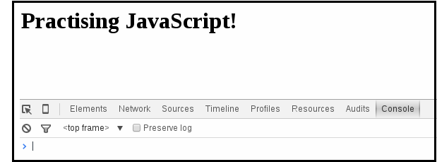
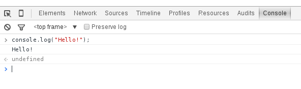

## What is JavaScript?

JavaScript is a programming language that runs in all modern web
browsers. It is used to change what is displayed on a web page in
response to user activity.

This tutorial will give you your first introduction to JavaScript. It
barely scratches the surface of all the things that you can do - this
one is intended to be just enough for you to understand our next
tutorials that do more interesting things.

Some words in programming have special meanings. We're going to take
some time during this tutorial to explain what some of the most
commonly used words mean. Words which mean a specific thing will be
marked in **bold**. Try to remember them, because it's important for
you to understand what other programmers mean when they use these
words, and what the documentation means when you read it. You can
always look back at this tutorial later to remind yourself.

## Getting started

Download the files required to begin working through the tutorial from [here](https://gist.github.com/despo/0b674ec9d5ae9cb09704/download).

We recommend that you use chrome for this tutorial, as the
instructions are written to match it closely, but you should be able
to do all the same things in any web browser.

We've given you two files. One is `script.js`, which you should open
in your text editor. This is where you're going to write your
code. The other is `index.html`, which you should open in your web
browser. This is a very short file that just tells your browser to run
the code in `script.js`.

For this tutorial, you will also need to open the console. In
Google Chrome, use `Ctrl + Shift + J` on Windows/Linux
or `Alt + Cmd + I` on Mac. The console should look something like this:



## Writing your first line of JavaScript

The console is a place where you can type a single line of JavaScript,
and it will immediately run. Try it out now, by typing the following
line into the console, then pressing enter:

```js
console.log('Hello!');
```

You should see something that looks something like this:



Your screen might not look exactly the same as this, but it should
have the same three lines of text at the bottom. If you don't see
this, get your coach to help you.

A few important things have happened here, which we're going to go
over in more detail in the next section. For the moment, you should
see where it's printed `Hello!` in your console. That's what
console.log does: it takes the thing you give it, and prints it in the
console.

You should also see two other lines: one with the code that you typed
in, and one that says `undefined`. There should be two little arrows
to the left of them. The arrows tell you that this line is about
something that was typed into the console directly. For now, just
remember what they look like.

Let's move on to writing code in a file. Type the same `console.log`
line into your `script.js` file. Save and reload the page in your browser so that it
can read the change you made.

This time, you should just see the line that says `Hello!`, and not
the lines that said `console.log('Hello!');` or `undefined` with
arrows next to them. That's because you didn't type the JavaScript
into the console this time.

### What you've learned so far

* How to type JavaScript into the console
* How to type JavaScript into a file
* How to print things to the console with console.log
* How to recognise the things you see on the console

We've been going really slowly so far, because it's essential that you
are able to do all these things for the rest of the tutorial. If you
are unsure about any of them, stop and ask your coach about it
now. Otherwise, we're going to move onto more interesting things.

## Values and expressions

Try typing a single `1` in the console. You should see that it
repeats the number back to you, with an arrow next to it.

Try typing `1 + 2` in the console. This time you should see it add the
numbers together and give you the result.

The `1 + 2` that you typed is an **expression**. What the console
printed with the arrow next to it is the **value** of that
expression. As you've just seen, the value of `1` is just `1`, and the
value of two numbers with a `+` sign between them is those two numbers
added together.

We want to do things with words as well as numbers. A value containing
letters is a **string**, and you write it in quotes. Try typing
`'Hello'` on the console. Like before, you'll see it repeated back to
you.

Try `'Hello' + 'there'`. You should see it combine the two strings
into one. The value of two strings with a `+` sign between them is
those two strings concatenated. You'll also see that it's missing a
space - can you fix that?

Try typing `Hello` without any quotes around it. See how you just get
an error about `Hello` not being defined? Words that are not wrapped
in quotes are not strings. There's a couple of things that they could
be, which we'll discuss later, but the important thing to remember for
now is that you can put anything you like into a string, but an
unquoted word has to be defined before it means something.

There are many more kinds of expressions and values, but we'll come
back to that later.

Remember:

* A **value** can be a single number or a single string
* An **expression** can combine several numbers or strings together
* Every **expression** can be reduced to a single **value**

## Variables

Try typing this on the console:

```js
var a = 17;
```

You'll see that it returns the value as `undefined`. undefined just
means that the thing you typed doesn't really have a value. However,
this did something else: it created a **variable** named `a`.

Now try typing `a` on the console. You should see that you get back
17. Variables are a way of giving names to **values** so that you can
use them later.

Try typing these:

```js
var b = 12;
var c = a + b;
```

Now look at the values of b and c. See how it's storing the values of
these expressions?

A line starting with `var` is a **variable definition**. You should
use this whenever you are creating a new variable.

You can also change the value of a variable. That's why it's a
"variable": because its value can vary. Try this:

```js
b = 2;
```

Notice that you don't have `var` this time. If you just have a
variable name, an equals sign, and an expression, then this is a
**variable assignment**, which changes the value of a variable that
you defined earlier.

You've just changed the value of `b`. Remember that you defined `c` to
be `a + b`? Look at `c` again and see if it has changed.

You should see that `c` has stayed the same. Now try assigning it again:

```js
c = a + b;
```

See that it's changed this time? This is because the **expression**
`a + b` is converted into its **value** immediately when it is used.

### Keywords, identifiers, and strings

The word `var` is a **keyword**: a word that means something special
to the language. `var` means "create a new variable".

Earlier in this tutorial, we had you try typing `Hello` on the console
without quotes, and you got an error about it not being defined. You
can put anything you like into a string, but things that aren't in a
string need to be defined to mean something before you can use
them. The `var` keyword defines a new word to be a variable. In this
section you created the variables `a`, `b`, and `c`, so you could use
those.

Unlike with strings, you can't use any word you like to be a variable
name. The kind of words that can be variable names are called
**identifiers**. Identifiers can contain letters, `$` signs, or
underscores `_`. They can also have numbers in them, but may not start
with a number. The rest of the punctuation on your keyboard cannot be
used in identifiers.

The other important rule is that you can't write an identifier that is
the same as a keyword, so you cannot create a variable called
`var`. If you try writing this then you will get a fairly obscure
error message:

```js
var var = 1;
```

## Functions

Start by typing this on the console:

```js
function sayHello() { console.log('Hello!'); }
```

It won't do anything just yet. This thing is a **function
definition**. You can recognise it because it starts with the word
`function`. It creates a new function named `hello`.

Now try typing this:

```js
sayHello();
```

This thing is a **function call**. You can recognise it because
it's a name with `()` immediately afterwards. Try calling `hello` again.

Let's move some of this into `script.js`. We wrote the function
definition all on one line because that's all the space you have in
the console, but the normal way to write one is like this:

```js
function sayHello() {
  console.log('Hello!');
}
```

Put that into `script.js` and reload the page. Now just try calling
the `hello` function on the console, without doing anything else. You
should see that it still works, using the definition that you put into
`script.js`.

Let's make a larger function. Put this one into `script.js`:

```js
function conversation() {
  sayHello();
  console.log('How are you?');
  console.log('Goodbye');
}
```

Try calling the `conversation()` function on the console. See how it
did all three things in order? Functions are lists of things to
do. When you call the function, it does all the things in its
definition.

Let's get a few words for these things before we move on:

* `hello` and `conversation` are the **name** of the functions
* The lines inside the braces `{}` are the **body** of the function
* Remember from earlier that a function name followed by parentheses,
  like `sayHello()`, is a **call**

Function names are **identifiers**, the same as variables. That means
they have exactly the same rules about what names you may give to your
functions. The word `function` itself is a **keyword**.

### What you've learned so far

* What **strings**, **expressions**, **values**, **variables**, and
  **functions** are
* What sort of names you can use for your variables and functions
* How to read and write number and string expressions
* How to use the `+` operator on numbers and strings
* How to store values in variables
* How to **define** and **call** functions

## Function parameters

Change your `hello` function definition to look like this:

```js
function sayHello(person) {
  console.log('Hello ' + person + '!');
}
```

Now try calling it using `sayHello('Archibald')`.

That probably isn't your name. Try calling the function again using
your own name.

What you've done here is to add a **parameter** to the function. When
you call the function, you put a string between the parentheses. In
the definition, you put the word `person` between the
parentheses. While the function runs, `person` is defined to be a new
**variable** with the **value** of whatever you used in the call.

Now add a `person` parameter to the `conversation` function as well,
and try it out.

> Some people use the word **argument** instead of
  **parameter**. While there are subtle differences in their meaning
  in computer science, the two words are interchangeable in practice.

## Function return values

Make a new function named `greeting`. Give it a `person` parameter
like the others.

In the body of this new function, write this line:

```js
return 'Hello ' + person + '!';
```

Try calling this function from the console. Look carefully at the
output: you should see that unlike all the functions you've called so
far, this one has a value.

`return` is another **keyword**: it means "return the value of this
expression from this function". The value of a **function call** is
the value that was given to `return`. If the function got to the end
without ever seeing `return` then the value of the call will just be
`undefined`.

Now change your `hello` function to use this new `greeting` function,
instead of having the message in it. Check that `conversation` still
works afterwards.

## Multiple function parameters

Functions can have as many parameters as you want. You separate them
with commas. Try changing the first line of the definition of
`conversation` to be:

```js
function conversation(person, topic) {
```

Now add another line to the function that prints `"Do you like " +
topic + "?"` on the console.

Similarly, you call the function like this:

```js
conversation('Archibald', 'owls');
```

Try it out for yourself.

### What you've learned so far

* How to pass **parameters** to functions, and how to **return**
  values from functions

## Statements

We've been putting semicolons `;` in various places. A semicolon marks
the end of a **statement**. So far we have been writing one line for
each statement, but this is not required. With a few exceptions, you
can add extra spaces and newlines anywhere you like. The following
statements all mean exactly the same thing:

```js
console.log('How are you?');
```

```js
console.log(
  'How are you?');
```

```js
console.log(
  'How are you?'
);
```

Use spaces and newlines to make your program easy to read. When you're
just starting out, it won't be immediately clear to you what makes
things easier to read, so just try to follow the patterns that we use
in the tutorials. As you read and write more programs this will start
to make sense to you.

### Semicolons

Semicolons are needed after any statement that does not end in a
`}`. While it is sometimes possible to leave out semicolons and have
the program still work, this is likely to break in surprising ways, so
you should try to put them in the right places.

One important exception to these rules is the `return` statement. You
may not add a newline immediately after the word `return`, because if
you write this:

```js
return
   a + b;
```

Then it is interpreted as meaning this:

```js
return;
a + b;
```

If you want to break up a return into multiple lines, you can write it
like this and it will work:

```js
return (
  a + b);
```

We apologise for this quirk of the language.

## Objects

Another type of **value** is an **object**. A way to create an object
is like this:

```js
var person = {
    first_name: "Archibald",
    likes: "owls"
};
```

The **object** referred to by the variable named `person` will now
have two **properties**, named `first_name` and `likes`. You can
access them by writing `person.first_name` or `person.likes`.

The `.` means "access an object's property". The value of
`person.first_name` is whatever value is stored in the `first_name`
property of the `person` object.

A **property** is a lot like a **variable**. You can change the value
stored in it by using `=`:

```js
person.first_name = "Aberforth";
```

### References

Objects are **values**. We tend to say "the `person` object", but what
we really mean is "the object referred to by the `person`
variable". This is important because you can, and often will, have
several variables that refer to the same object. Try this:

```js
var person_a = {
    first_name: "Archibald",
    likes: "owls"
};
var person_b = person_a;

console.log("Before");
console.log(person_a.first_name);
console.log(person_b.first_name);

person_a.first_name = "Aberforth";

console.log("After");
console.log(person_a.first_name);
console.log(person_b.first_name);
```

Look carefully at the output. Would you expect person_a.first_name to
be the same as person_b.first_name?

Writing `person_b = person_a` copies the **reference** to the object,
so that you have both variables referring to one object. You can then
change the object through `person_a`, and see the changes that you
made to the object through `person_b`.

### Methods

It is also possible to store a function in a property. When we do
this, we use the word **method** instead of **property**. You call a
method by combining the way you write properties with the way you
write function calls:

```js
console.log('Hello!');
```

You may recall this line from the start of the tutorial. You now know
enough to understand that `console` is an object, and `log` is a
method on the console object.

There are many more things that can be said about objects, and we will
return to them in a later tutorial.

## Summary

You now know what all of these words mean:

* strings
* expressions
* values
* variables
* functions (definitions and calls)
* parameters
* statements
* objects
* properties
* methods

You also know how to do all these things:

* Use the javascript console
* Store values in variables
* Add numbers and combine strings with `+`
* Define and call functions
* Access object properties
* Call object methods
* Understand what everything in `console.log('Hello!');` means

If you're uncertain about any of these, ask your coach! You'll be
needing to know all of them for our next tutorial.

---
This ends our **Introduction to JavaScript** tutorial. Is there something you don't understand? Try and go through the provided resources with your coach. If you have any feedback, or can think of ways to improve this tutorial [send us an email](mailto:feedback@codebar.io) and let us know.
