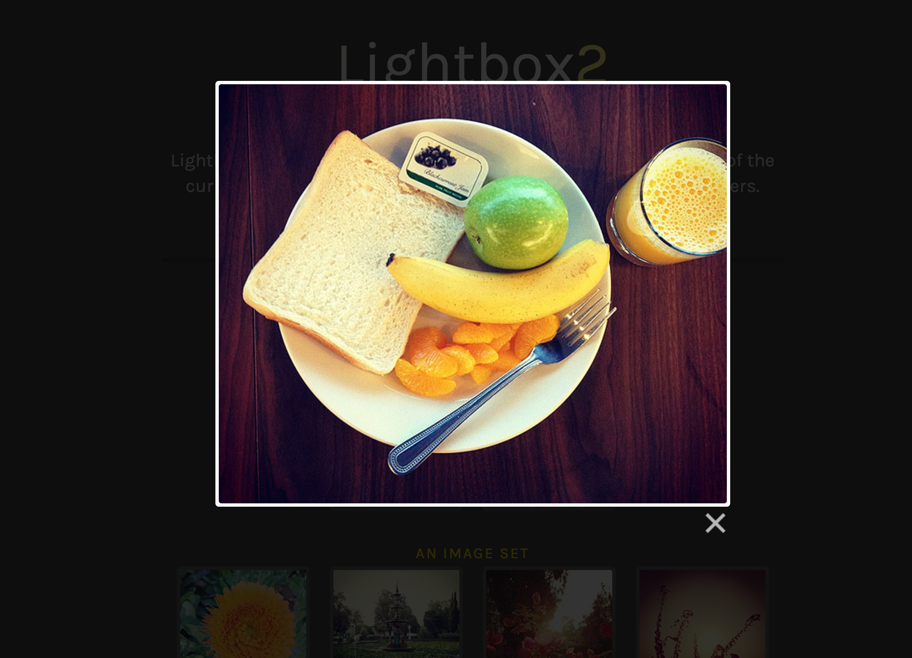

## What is JavaScript?

**JavaScript** is a popular programming language that runs in all modern web browsers. Along with CSS and HTML, it's one of the core technologies of the web and can do wonderful things for websites! It's most commonly used to make web pages interactive:

Some of the things JavaScript on the web can do:

#### [Lightboxes](http://lokeshdhakar.com/projects/lightbox2/#example)



#### [Data visualisations](http://www.nytimes.com/interactive/2013/04/08/business/global/asia-map.html?_r=0)


#### Many other cool things!

[The interactive ear](http://www.amplifon.co.uk/interactive-ear/index.html)


[Stack of cards](http://designlovr.com/examples/dynamic_stack_of_index_cards/)


It is also becoming more common outside of the browser. You can write your own server programs in JavaScript using [Node.js](http://nodejs.org/).


### Today let's focus on understanding the basics

## But before we start...

### Required files

Download the files required to begin working through the tutorial from [here](https://gist.github.com/despo/0b674ec9d5ae9cb09704/download)

## Let's try out some JavaScript!

We'll start by just outputting some content on our browser's inspector console.
To keep track of what we do, you should write the code in the `script.js`

First open up your HTML page and the **inspector**.

> We will be doing a lot of refreshing to see our changes! **JavaScript** loads when the page opens, so it's essential to refresh!

Let's write out something in the console, to make sure that our file is in place and working!

```js
console.log("Hello! This is my first line of JavaScript!");
```

There are a few things going on here. For now, all you need to know is that `console.log` is a *function* that allows you to print something to the console. The stuff between the brackets is what gets printed.

##Variables and Expressions

### What are Variables?

Variables are objects that hold content. They are declared using `var` and we can assign values to them.
```js
var hello = 'Hello Codebar!'
```

### What are expressions?

Expressions are a set of variables, operations and expressions that get evaluated together.


#### Let's try and understand variables by building some simple expressions

There are different types of variables that we can declare:

Try them out one by one!

- **strings** - group of characters, it must always be in quotes

```js
var name = "codebar";

console.log(name + " is amazing!"); // this is an expression
```

> Can you see the output in your console? Try changing the value of `name`

The `+` operator adds things together. For strings, this means *concatenating* them. If anything other than a string is added to a string, JavaScript will try to turn it into a string first.

- **numbers**

Let's output the value of pi:

```js
var pi = 3.14;

console.log("The value of pi: " + pi);
```

In the above case, a number is being added to a string. JavaScript turns the number into a string, and then puts the two strings together.

Now let's output the current year, and auto-calculate the value of the next year using **addition**

```js
var year = 2015;
var nextYear = year + 1;

console.log("We are in " + year + ", but " + nextYear + " is just around the corner!");
```

That's great! We can combine strings together and add up numbers.

> Sometimes you may forget to use `;` after a statement. Usually this is ok, but sometimes strange things can happen. Try not to forget to use `;`.

- **booleans** - true/false

```js
var codebarIsAwesome = true;
var weatherIsAmazing = false;

console.log("Is codebar AWESOME? " + codebarIsAwesome);
console.log("Is the weather in London amazing? " + weatherIsAmazing);
```

- **undefined**
If no value is set for a variable, then it will automatically be set to undefined.

```js
var iDontHaveAValue;

console.log("What kind of variable am I? " + iDontHaveAValue);
```
> The general convention in JavaScript is to use `lowerCamelCase` while naming variables.

### Operations
There are a number of operations you can apply, just like when using math.

Let's section the output by outputting a title

```js
console.log("Operations");
```

#### addition  `+`

```js
var x = 6;
var y = 3;
var addition = x + y;

console.log("Addition: x + y = " + addition);
```

#### subtraction `-`

```js
var subtraction = x - y;

console.log("Subtraction: x - y = " + subtraction);
```

#### Multiplication `*`

```js
var multiplication = x * y;

console.log("Multiplication: x * y = " + multiplication);
```

#### Division `/`

```js
var division = x / y;

console.log("Division: x / y = " + division);
```

### The if statement
In JavaScript we can write conditions to control what we output

Let's try this out.

```
if (codebarIsAwesome) {
  console.log("codebar is AWESOME!");
}
```

Isn't that cool! :)

We can also write a condition that checks for the opposite, so, not true

```js
if (!codebarIsAwesome) {
  console.log("codebar is not so awesome :(!");
}
```

> This should not output anything. Try setting `codebarIsAwesome` to false before running this expression.

> Did you use `var`? Since we have already declared our variable, you shouldn't need to do that.


The `if` statement will try to turn anything in the round brackets into a `true` or a `false`. It is very common to let it do this, so when you see some JavaScript in the wild, be prepared! The following things become `false` when used in an `if` statement:

 - `false`
 - `0`
 - `"" // (an empty string)`
 - `null`
 - `undefined`
 - `NaN`

Don't worry about what all of these are yet. It'll become more clear as you go on.

Conditions work with a number of evaluated statements. Some of the comparisons we can use are:

#### Strict equality `===`

```js
var apples = "apples";
var oranges = "oranges";

if (apples === oranges) {
  console.log("Apples and Oranges are the same thing!");
}
```

There is also a relaxed equality called simply 'equality' that looks like `==`. JavaScript developers try to avoid it, because it behaves strangely. Ask your instructor for more information, but also remember to avoid `==`.

This should not output anything, **apples** and **oranges** are not the same thing!

#### Strict inequality `!==`

```js
if (apples !== oranges) {
  console.log("Apples are not Oranges!");
}
```

As with `===`, there's a version of strict inequality called simply 'inequality'. It also behaves strangely and should be avoided.

#### Greater than `>`

```js
var coaches = 20;
var students = 24;
var pizzas = 25;

var people = coaches + students;

if (people > pizzas) {
  console.log("We have more people than pizzas!");
}

if (students > pizzas) {
  console.log("But we have more students than pizzas! Let's not give the coaches any food.");
}
```

#### Less than `<`

```js
if (coaches < students) {
  console.log("We have less coaches than students.");
}
```

### if-else statements

An **if-else** statement enables us to run alternative actions when our condition is not true

```js
if (people > pizzas) {
  console.log("We have more people than pizzas. That's not very good :/");
} else {
  console.log("We have waaay too much pizza. That can never be bad! :)");
}
```

> Try changing the numbers. What happen when you set students to `2`. Do you see the else part of the statement being evaluated?

## Functions

Functions are a major part of every programming language. They enable us to create meaningful snippets of code that we can rerun without having to define the same things again.

Let's write a small function that prompts someone accessing our page with a message.

Let's do this in steps. First create a function:

```js
function hello() {
 console.log("Hello!");
}
```

If you refresh the browser, you will notice that nothing is printed. This is because we must *call* our function in order for it to be evaluated and give us a result.

```js
hello();
```

Now let's extend out function to take in **arguments**. We want it to say hello to different people.

```js
function hello(name) {
 console.log("Hello " + name + "!");
}
```

Arguments are a list of variables that will be given when the function is called. Think of them as placeholders.

If you now run `hello();` you will notice that it says "Hello undefined".

>  Why is that? Do you know? Have a look at **undefined variables** if you don't remember

Ok, so let's call the function with our name.

```js
hello("codebar");
```

> Call the function with your name and your coach's name. Do you see the output?

Let's write an improved version of this that shows a small dialog with the message.

> We'll only give you a part of the function, try to make this work.

```js
function popupHello(name) {
  alert("Hello " + name);
}
```

Now that you fixed the problem, call the function from you browser's console!

> Don't add the call to the function in your `script.js`(It will get annoying to see it every time you refresh!)

### Multiple arguments

So far we've tried out functions with zero arguments and one argument. But we can use more! Let's try writing a function with multiple arguments.

```js
function whatIAmDoingToday(coach, place) {
 console.log("Today, I am at " + place + " and I am learning a bit of JavaScript with the help of " + coach);
}
```


### Returning values

Besides printing, which is nice when learning as it makes it easier to see the result, we can also `return` values.

Create a function that adds two numbers together

```js
function addNumbers(x, y) {
  x + y;
}
```
> Try to run this. Not what you expected is it?

To fix this, we must explicitly use `return` when we want the function to give us back the result

Change the function to

```js
return x + y;
```

> Anything after the return will be ignored. What happens when you add some content before the end of your function but after defining `return`?

You can fill an argument of a function with a call from another function. It's common to see this, but better to assign the value to a variable first. What do you expect to get when running `addNumbers(addNumbers(1,2), 4);`? Try it out.

### Scope

When we declare a variable within a function, they are not visible outside it.

```js
function subtractNumbers(x,y) {
  var result = x - y;
}

subtractNumbers(10,3);
console.log(result);
```

But, when we declare them outside the function, they are

```js
var result;

function subtractNumbers(x,y) {
  result = x - y;
}

subtractNumbers(10,3);
console.log(result);
```

In the second example, `result` does not belong to `subtractNumbers`, but it can see and change it. In the first example, `result` is only defined inside the `subtractNumbers` function. The error that the first example above makes will tell you more information.

There is another possibility:

```js
var result;

function subtractNumbers(x,y) {
  var result = x - y;
}

subtractNumbers(10,3);
console.log(result);
```

Notice that the variable `result` has a `var` both outside and inside the function. This means that they are actually *two different variables*. This is called *shadowing*. It can be confusing, so try not to do this.

## Bonus
Now you know enough to write your own little **JavaScript** program!

With help from your coach try and write a program to do the following
- Store your name in a variable

- Store information about yourself in a variable

- Store how many codebar sessions you have attended

- Make the program output
  ```
  Hi! My name is _name_.
  A couple of things about me _about you_.
  I have attended _number of sessions_ codebar sessions so far!
  ```

- if the number of sessions attended is 0
  ```
  This is the first time I'm attending codebar!
  ```
- If the number of sessions attended is more than 0
  ```
  This is not my first time here. I <3 codebar!
  ```

---
This ends our **Introduction to JavaScript** tutorial. Is there something you don't understand? Try and go through the provided resources with your coach. If you have any feedback, or can think of ways to improve this tutorial [send us an email](mailto:feedback@codebar.io) and let us know.
