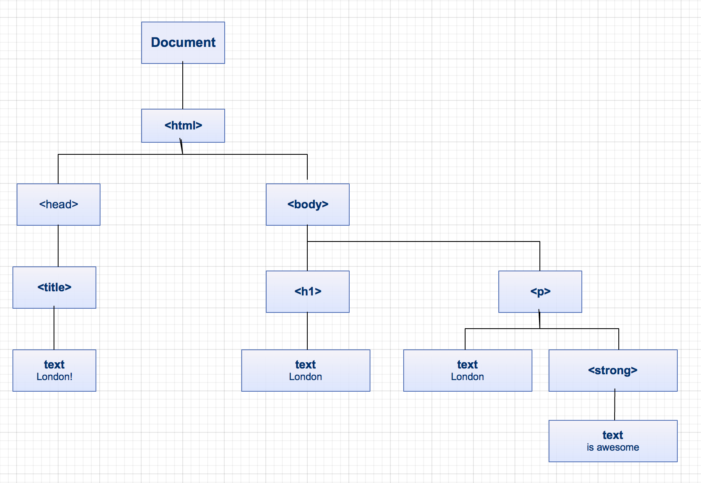

In our previous lesson we briefly introduced JavaScript, variables.  This time we will be explaining Loops, Arrays, Objects and the DOM.

## Before we start...

### Required files

Download the files required to begin working through the tutorial from [here](https://gist.github.com/despo/d46495ce986d1624af45/download)

You should use **lesson2.html** and **script.js** to write the exercises in for the first part of the tutorial, and **london.html** and **london-script.js** for doing the DOM exercises.

## Loops

A loop is used to execute a set of statements repeatedly until a condition is met.

#### The **while** loop

The **while** loop is the simplest and most general loop in JavaScript. It looks a bit like an `if` block, and just like an `if` block, the stuff in the round brackets is a test.

```js
while (test) {
    // Do some stuff.
}
```

When the while loop starts, the test is checked. If it is false, then the while loop is skipped. If the test is true, then just like an `if` block the statements in the curly braces are executed.

The difference is in what happens after the statements in the block. With an `if`, everything is finished and the statements below the if block are executed. With a `while`, we go back up to the test. If the test is still true, the statements in the block are executed again, and so on until the test is false. This is why we call it a loop.

We can use this to sum all numbers from 1 to 10:

```js
var i = 1;
var total = 0;

while (i <= 10) {
  total = total + i;
  i = i + 1;
}

console.log("Total: " + total);
```

> `<=` stands for **smaller or equal**. We can also express `<=10` using `< 11`

You can read this as:

 - Start with variables `i = 1` and `total = 0`.
 - While `i` is less than or equal to 10:
  - Add `i` to `total`, and update `total` with the result.
  - Add `1` to `i`, and update `i` with the result (increment `i`).

Since the value of `i` goes up by one at the end of each loop iteration, eventually (when `i` is 11) the test will be false, and the while loop stops.


#### The `for` loop

The `for` loop offers the same behaviour as a while loop, but arranged in a way that is often more convenient. It's very common in loops to have a counter (as there was in the case above), and the `for` loop caters especially for this.

```js
for (/* before loop starts */; /* test before each iteration */; /* after each iteration */) {
  //set of statements
}
```

The stuff in the round brackets is split into three parts by `;`. The first part is used once, before the loop begins. It's a good place to set an initial value for a counter (like `x = 1` in the `while` loop example).

The second part is a test, and just like in the `while` loop it is checked before each iteration.

The third part is executed after each loop iteration. It's useful for incrementing the loop counter.

The `while` loop above can be rewritten as a `for` loop:

```js
var total = 0;
var i;

for (i = 1; i <= 10; i = i + 1) {
  total = total + i;
}

console.log("Total: " + total);
```

Even though `while` loops are more simple than `for` loops, it is more common to see `for` loops. This is because loops are often used to do something with arrays, which are introduced in the next section.

## Arrays

An array is a simple *data structure*. It can hold a list of elements of the same or different types (e.g. strings, numbers, booleans). In an array each element can be accessed using the **index**.

It may be a bit confusing, but the first index of an array is 0, and not 1.

To understand this better, let's try and represent the array below.

```js
var animals = [ "dog", "cat", "rabbit", "horse", "elephant", "monkey" ];
```


To retrieve an item from the array, we use **square bracket notation**

To get the first item `animals[0]`, the second `animals[1]` etc.

### Properties -  `length`

The `length` property returns the size of the Array

```js
animals.length
```

The length property is extremely useful when you want to do something with every element in an array. For example, to log each entry of the `animals` array, you can use `animals.length` with a `for` loop:

```javascript
var i;

for (i = 0; i < animals.length; i = i + 1) {
  var animal = animals[i];

  console.log(animal);
}
```

Note that we go up to, but do not include `animals.length` as an index. This is because arrays are indexed from zero, so the last index is always one less than the length.

### Methods

The word `method` is usually used to mean a function that belongs to an object. It's common to see them used with the *dot* notation.

#### Adding objects to an array

`array.push(object)` adds an element to the end of the array
`array.unshift(object)` adds an element to the beginning of the array

```js
animals.push("zebra")

animals.unshift("cow")
```

#### Removing objects

`array.pop()` removes and returns the last element

> What do you expect to get when apply `pop()` to the animals array? Try it out.

Analogously, `array.shift()` removes and returns the *first* element of the array.

### Ordering

To order the elements of an array we can use `sort()`.

```js
animals.sort()
```

Try this out on an array of strings.

```js
var names = [ "Jane", "Barry", "Helen", "David", "Sam" ];

names.sort();

console.log(names);
```

`sort` takes an array and sorts items in a kind of alphabetic order (but be careful of capital letters and special characters). `sort` can be (and usually is) customized to sort things in any way you like. It can take a function as an argument to tell it what to do. For example:

```js
function sortNumbersAscending(a, b) {
    return a - b;
}

var nums = [ 1, 5, 3, 19, 2, 10 ];

nums.sort(sortNumbersAscending);

console.log(nums);
```

Sort passes pairs of entries from the array to `sortNumbersAscending`. If `sortNumberAscending` returns a number less than zero, then sort knows that `a` should come before `b`. If the number is greater than zero, then `b` should come before `a`.

Another cool operation you can apply is `reverse()`.

```js
animals.sort().reverse();
```

```js
// Sort numbers descending.
nums.sort(ascending).reverse();
```

> Can you write a function called `sortNumbersDescending` that can be used in place of `.sort(ascending).reverse()`?

### Loops again!

Now that we know what arrays are, we can use that to understand loops better. Let's try out another example:

```js
var fruitAndVeg = [ "apple", "orange", "banana", "kiwi", "avocado", "celery", "aubergine" ];
var noAvocados = [];
var i = 0;

while (i < fruitAndVeg.length) {
  if (fruitAndVeg[i] !== "avocado") {
    noAvocados.push(fruitAndVeg[i]);
  }

  i = i + 1;
}
```

> Can you understand what this loop is doing? Try to explain it to your coach.


There is a counter here though, so a better way to write this would be:

```js
var fruitAndVeg = [ "apple", "orange", "banana", "kiwi", "avocado", "celery", "aubergine" ];
var noAvocados = [];

for (var i = 0; i < fruitAndVeg.length; i = i + 1) {
  if (fruitAndVeg[i] !== "avocado") {
    noAvocados.push(fruitAndVeg[i]);
  }
}
```


## Objects

### So what are objects?
Objects are very important in JavaScript. In fact, you've already used a special kind of object (arrays). Objects are containers for anything you like, including objects and functions. JavaScript makes creating objects very easy.

They are special kinds of data, with **properties** and **methods**

```js
var message = "It's cold today"
console.log(message.length);  // using length property
console.log(message.toUpperCase());  // using toUpperCase() method
```

### Creating our own objects

Here is the basic template for creating an object with some properties

```js
var object = {
  propertyName: propertyValue,
  propertyName: propertyValue,
  ...
}
```

Let's apply that to store some information about London.

```js
var london = {
  name: "London",
  population: 8308369,
  tallestBuilding: {
     name:  "Shard",
     height: "310m"
  },
  numberOfUniversities: 43,
  averageRent: 1106,
  dailyTubePassengerJourney: 3500000,
  olympics: [ 1908, 1948, 2012]
}
```

To access the properties, we can either use the **bracket notation** like in Arrays, or the **dot notation**

```js
console.log("Population of London: " + london.population);
```

As you can see, we can also define **nested objects**, like _tallestBuilding_. We can access their properties in a similar way.

```js
console.log("The tallest building in London is the " + london.tallestBuilding.name + " with a height of " + london.tallestBuilding.height);
```

And we can also use arrays within them!

```js
var i;

console.log("The olympics took place in London in:\n");

for (i = 0; i < london.olympics.length; i = i + 1) {
  console.log(london.olympics[i]);
}
```

## The DOM

###What is the DOM?
**DOM** stands for **D**ocument **O**bject **M**odel.

When the HTML is loaded on our page, the browser generates its DOM. This enables us to access and interact with HTML elements using JavaScript.

#### DOM representation

```html
<html>
  <head>
   <title>London!</title>
  </head>
  <body>
   <h1>London</h1>
   <p>
     London <strong> is awesome</strong>
   </p>
  <body>
</html>
```



### Interacting with the DOM

The **DOM** is represented by **nodes**. Each node has different properties, and nodes are connected (like in the tree diagram above).

Let's try interacting with the DOM of our page by getting the parent node of the body.

> Try this using the console on the inspector. As the script gets loaded before the body, the element will not be there if you try adding this to the **script.js**

```js
console.log(document.body.parentNode);
```

To get around this issue, we will be wrapping our called in functions triggered by the interface.

Write a function that lists all DOM children elements.

```js
function listDomElements() {
  var children = document.body.childNodes;
  var i;

  for (i = 0; i <  children.length; i = i + 1) {
    console.log(children[i]);
  }
}
```

and add a link that triggers the function

```html
<a href="#" onclick="listDomElements()">List DOM elements</a>
```
> Awesome!

**But interacting with DOM doesn't need to be this complicated.**

An easier way of interacting with the DOM is by retrieving elements using their tag.

```js
document.getElementsByTagName("h1");
```

That's not very easy though, as it's likely that you will have multiple paragraphs, divs, links or other elements.

The most common way, is by retrieving elements by id.

Add an id `description`to the paragraph element.

```js
var description = document.getElementById("description");
console.log(description.innerHTML);
```

### Modifying the HTML

### Steps for creating new elements

There are three main steps we need to follow to achieve this.

1. creating an element
```js
document.createElement(<tagName>);
```
2. creating text nodes
```js
document.createTextNode(<text>);
```
3. adding children to elements
```js
document.appendChild(<node>);
```

Try this out using the london object we declared previously

```js
var london = {
  name: "London",
  population: 8308369,
  tallestBuilding: {
     name:  "Shard",
     height: "310m"
  },
  numberOfUniversities: 43,
  averageRent: 1106,
  dailyTubePassengerJourney: 3500000,
  olympics: [ 1908, 1948, 2012]
}
```

#### Display the population

```js
function displayPopulation() {
  // Make a new <p></p> for population. This is not attached to the DOM yet.
  var population = document.createElement("p");

  // Make some text content to put into your <p></p>
  var content = document.createTextNode("Population: " + london.population);

  // Put the text content into the <p></p>.
  population.appendChild(content);

  // Finally the population can be appended to the body, and will become visible in the browser.
  document.body.appendChild(population);
}
```

> Don't forget to add a link that calls the function.

Create functions that load all the individual information we have stored about London. If you are having trouble ask for help from your coach.

> When you are done with this, try creating one main function that does the calls. Use the JavaScript `onload()` event on the body, similar to how we used the `onclick()` event previously, to add the information to the page.


### Bonus

Modify the JavaScript file we used in the first part of the lesson, and its HTML page so that you can load the information on the page instead of the console.

> Remember to wrap your code in functions!

---
This ends our **Beginning JavaScript**. Is there something you don't understand? Try and go through the provided resources with your coach. If you have any feedback, or can think of ways to improve this tutorial [send us an email](mailto:feedback@codebar.io) and let us know.
