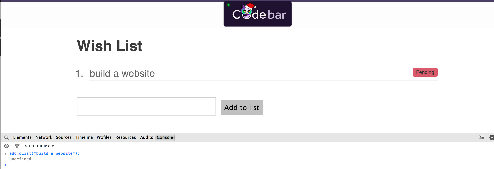
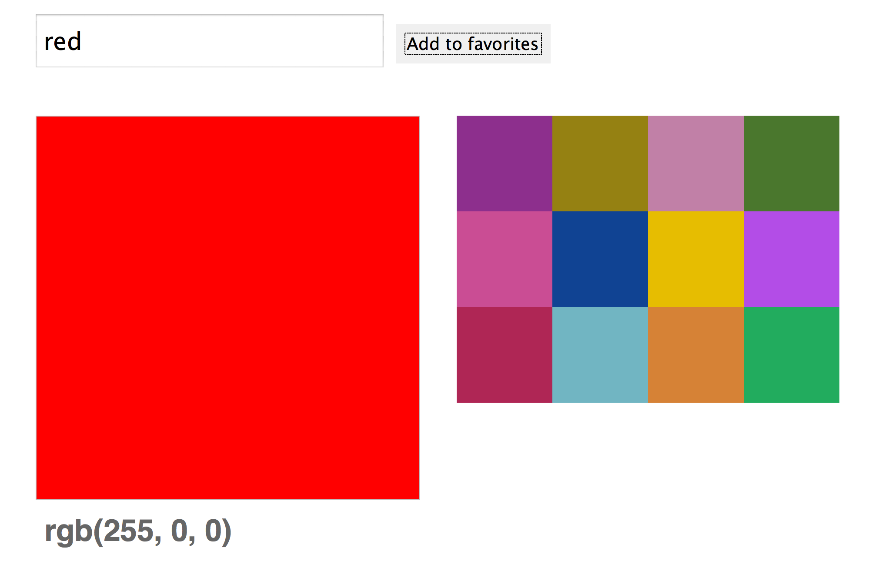

So far, we've learned the basics of JavaScript. From variables, to understanding Objects, functions and how to manipulate the &#x200b;**D**&#x200b;ocument &#x200b;**O**&#x200b;bject &#x200b;**M**&#x200b;odel.

# What is jQuery?

jQuery is a widely used JavaScript library to help you find and change html elements on web pages, and do things in response to user events.

## Selectors

jQuery lets you identify the html element that you want to work on
using `CSS` selectors. It uses the odd-looking `$()` function to do
this. We write a jQuery selector by passing the `$()` function a
selector as a string, like this:

```javascript
$('div')              // all div elemenets
$('#container')       // the element with the ID container
$('.total')           // selects all elements with the class total
```

## jQuery objects

The `$()` function returns a `jQuery object`. This object refers to
the elements that you selected. You can then call jQuery methods on
this object to inspect or change those elements.

```javascript
$('#container').text('This is the new text')   // Replace the text inside the element with ID 'container'
$('.total').css('color', 'red')                // Set the CSS color to be 'red' on every element with class 'total'
```


# Exercise 1: Build a wish list

Using jQuery and JavaScript functions, we are going to build a small
todo list.

Download the files that you will need to work through the example
[here](https://gist.github.com/despo/309f684b7a6e002aaf1f).

Alternatively, if you've already learned how to use git and would like
to use it here, you can clone this repo:

```bash
git clone https://gist.github.com/309f684b7a6e002aaf1f.git wishlist
```

The files that you start with don't really do anything, so let's
start by making the 'Add to list' button work.

## Add wishes to the list

### Try it out

To get started, open `index.html` in your web browser, and open the
javascript console.

> In chrome, use Ctrl-Shift-J or Cmd-alt-J to open the console

There is a list on this page with id `items`. You can't see it yet
because it's empty. Let's start by adding something to it. Try typing
this into the console:

```js
$('#items').append('<li>My first item</li>')
```

You should see an item appear in your list.

The `$('#items')` function returned a jQuery object that has selected
the html element with id `items`. You then called the `append` method
on this object. The append method takes an html string as a parameter,
and appends it to the element that you selected.

### Write some code

Now we can turn this into a function to add items to the list. Open
`script.js` in your text editor and start writing a function:

```js
function addToList(item) {

}
```

The code you want to put in this function looks a lot like what you
wrote on the console earlier, but instead of adding 'My first item',
we want to add the parameter to this function:

```js
'<li>' + item + '</li>'
```

Once you've done that, reload `index.html` in your browser, and try
running the function you've just written from the browser console.

```js
addToList('build a website');
```

You should see your item added to the list.

## Make the input box work

There's an input field and button on the page. We're now going to
connect those to the function you just wrote.

### Try it out

Go to your web browser, type some text in the input box, and open the
javascript console.

Write a `$()` selector that selects the input box. Look at the
`index.html` file to find the id of the input element.

Try calling the `.val()` method on that object. It should return the
current contents of the input box.

Now try calling the same method with a string parameter. See how this time it changes what the input box contains?

> This is a common pattern in jQuery: calling a method with a new value as a parameter will change that property, while calling it without a parameter will return the current value.

To tie it all together, type some text in the input box, and call your
addToList function with your `.val()` call as a parameter. You should
see this add the text from the input box to the wishlist.

### Write some code

Now you know how to get the contents of the input box, and change
it. Next you need to make all this happen when the button is clicked.

We can use the `click` method to add an `event handler` that will be
called when the user clicks on something. Add this new function to
`script.js`:

```js
$(document).on('click', '#add-to-list', function() {

});
```

Inside this function, add the line that you worked out earlier which
calls addToList with the current value of the input box.

That's all you need! Check that it works in your browser. You should
be able to type something into the input box, click the button, and it
will be added to the list.

When you've got that working, add another line to your click event
handler, that empties the input box after adding the item to the list.

This is a good time to pause, read back through all the code you've
written, and make sure you understand what it all does. Ask your coach
about anything that isn't clear to you. We're going to be building on
these ideas in the next few steps.

### Bonus

After you click on the button, the cursor is no longer in the input
box. That's a bit annoying. Use jQuery's `focus()` method to place the
cursor back in the text field after clicking the button.

If you aren't sure how to use the focus() method, try searching for it
in the [jQuery documentation](http://api.jquery.com/). There are some
code examples illustrating how to use it.

## Label items

We're now going to add labels to the items in the list, so that you
can mark them as done.

Start by adding a 'pending' label to each item when it gets added to
the list. Change your addToList function so that when you call
`addToList('build a website')`, it adds this html code:

```html
<li>build a website<span class='label pending'>Pending</span></li>
```

Refresh the page and try it again. You should see something that looks
like this:



## Setting items to complete

When we click on the 'Pending' label, we want to mark items as
complete. We shall do this by removing the 'Pending' label and adding
a new 'Done' label.

Start by making a new click event handler for the '.pending' class.

The code we put inside the event handler this time is a little more
interesting, because we want to change the item that was clicked
on. JavaScript gives you the element that the event came from in a
special variable called `this`. Because `this` comes from JavaScript
itself, it is not a jQuery object. We can fix that by passing it to
the `$()` function, as `$(this)`.

In our case, the element that the event came from is the `<span
class='label pending'>` element that was clicked on. We can use the
jQuery `.parent()` method to find the parent of that element, which
will be the `<li>`.

So, begin your new event handler with this line:

```js
var li_node = $(this).parent();
```

Now that you have the right list item, use `.append()` to add a new
label `<span class='label success'>Done!</span>`, and then use
`.remove()` to remove the Pending label.

### Bonus

We can make this look a little better. A useful technique is to add
and remove css classes. Try adding this line to your event handler:

```js
li_node.addClass('completed');
```

In your web browser, use the 'Inspect element' feature to look at a
list item, then click on the Pending label. See how it now has
class="completed" in the inspector, and is now getting styled by
things in the css which apply to that class?

This approach lets us keep all our styles in css files, and have
javascript turn them on and off.

## Show the total task count

### Try it out

Go to your web browser, add some items to the list, and open the
javascript console.

Start by writing a jQuery selector that selects all the pending
labels. You can use the `.length` property to find out how many
elements on the page a jQuery object refers to. Try it now - get the
number of pending labels, and the number of completed labels.

> `.length` is a property, not a method, so you don't add a `()`

Store those lengths in two variables called `pending` and `completed`.

Now let's display them on the page. Look at `index.html` and find the
span that comes just below the `<ol>` element. Write a jQuery selector
for that element, and then call `.text('Pending: ' + pending + '
Completed: ' + completed)` on it.

### Write some code

You now know how to count the number of items in the list and display
the totals. Write a new function called `updateTotal` to do this.

Update the displayed totals by calling `updateTotal()`

1. after adding an item to the list
2. when changing the state of an item from **Pending** to **Done**

### Pushing to Github page

If you're using git for this exercise, you can push what you've made to your github page.

Link to wishlist/index.html from the `index.html` of your Github page. Push your changes to the _github-pages_ branch and check you can access the project from the internet.
Access the wish list at **http://`<username>`.github.io/`<project>`/wishlist/index.html**

Have a look at our [**Wish List**](../../examples/wishlist/index.html).


## Exercise 1 recap

Here are the things you learned about in exercise 1:

1. The `$()` function creates a jQuery object that you can call methods
   on. You can pass it a selector, like `$('#add-to-list')` or
   `$('.pending')`, or a javascript object like $(this) or $(document).

2. The jQuery methods `.append()` and `.remove()` can be used to add
   and delete elements on the page.

3. jQuery methods like `.text()`, `.val()`, and `.addClass()` can be
   used to get things from the page and change them.

4. The `.on()` function can be used to add an event handler. By making
   a handler for the `click` event, you can run your code when
   somebody clicks on something on the page.

# Exercise 2: Build a colourpicker

Before you start, close any windows you still have open from the last
exercise. This one also has files called `index.html` and `script.js`,
and you don't want to edit the wrong one by accident.

[Download the files](https://gist.github.com/despo/ab21d29aa1ea8fbbbb0e/download) required to begin working through the example.

If you're using git, you can clone this repo instead, and move the
files under your Github page folder, in a directory called
`colourpicker`. Don't forget to commit each task you complete! That way
it will be easier to retrace your steps if something goes wrong!

```bash
https://gist.github.com/ab21d29aa1ea8fbbbb0e.git
```

We're going to make a page where you can pick css colours and make a
list of favourites. Like last time, you're starting from some html
that doesn't really do anything yet. The finished version will look
something like this:



## Colour the preview area

The big rectangle is meant to be a preview of the colour that you have
typed into the text box above it. We're going to start by making a
function to set the colour of this area.

### Try it out

Have a look at `index.html`, and find the div called `preview`. In the
javascript console, write a jQuery selector for this element.

This time you're going to use the `.css()` method to change the style
of the element. To set a css property, you pass this function two
parameters: the name of the property to set, and its value. Try
setting the background colour to purple, like this:

```js
.css('background-color', 'purple')
```

> We write `colour` in English, but Americans spell it `color`. CSS
  uses the American spelling, and it won't work if you write `colour`
  instead.

### Write some code

Write a new function in `script.js` called `setPreviewColor`. Make it
take a colour as a parameter and set the preview area's background to
be that colour.

Try it out in the javascript console: `setPreviewColour('purple')`.
You should see the same thing you did before.

## Colour input box

Next we're going to make the input box set the colour. Start by
looking in the html for the `<input>` element. On the javascript
console, write a selector for it and get its current value.

In the last exercise, you used the `.on()` function to add an event
handler for the `click` event. This time, you're going to handle the
`keyup` event: that's when somebody has released a key on the
keyboard. Write that event handler now.

> Remember that you call the `.on()` function on the `$(document)`
  object, pass it the event name as the first parameter, and the
  selector for the element you want to handle events for as the second
  parameter.

We're not giving you an example here - you learned how to do all these
things in exercise 1. Look back at how you did this before if you need
a reminder.

In this event handler, call `setPreviewColour` and pass it the current
value of the input box.

When you've got all that working, you should see the preview area
change colour when you type colour names into the input box.

> Bonus question: why does the colour only change when you finish
  typing in a colour?

## Display the rgb value of the colour

### Try it out

Set the colour to purple again, and then use the javascript console to
write a selector for the preview area, and call the css method on it
again, like when you were setting the colour earlier. This time, we're
only going to pass one parameter to the method:

```js
.css('background-color')
```

You should see that instead of setting the colour, it returns the
current colour. When you call jQuery methods that can change
something, and don't pass them a new value, they return the current
value.

Interestingly, you set the colour to 'purple' but it has been returned
in rgb(x,y,z) form. Colours always get converted into this form when
they are set. We can use this to add another feature to our colour
picker.

### Write some code

Extend your `setPreviewColor` function to set the text of
`.color-code` to the rgb value that you read back from the `.preview`
div.

## Add colours to favorites list

Next we're going to make the 'Add to favorites' button work. When it
is clicked, it should add a box to the `#colors` div using the current
value of the input text field.

Write a new function `addBox(color)` that makes a new box and adds it
to the beginning of `#colors`. You can use the jQuery `.prepend()`
method to add something to the start of an element, and something like
this to make the new box:

```js
"<div class='item' style='background-color: " + color + ";'></div>"
```

> Run `addBox('FF0033')` from the console to make sure your code works.

## Call the the `addBox` function from the `click` event

Write a new click event handler for the 'Add to favorites'
button. Make it do the following things:

1. Retrieve the value from the `#color` field
2. Add a box with that color
3. Reset the value of the `#color` field

## Setting up initial colours

### Try it out

For this next part, we're going to use a feature of jQuery that isn't
related to changing web pages. Open the javascript console. Start by
defining an array:

```js
var words = ['these', 'are', 'some', 'words'];
```

We're going to use the jQuery `$.each` function. This isn't related to
the `$()` function, it takes an array and a function and calls the
function once for each thing in the array. Try this:

```js
$.each(words, function(index, word) {
   console.log('Position ' + index + ': ' + word)
});
```

See how the function got called with `(0, 'these')`, then with `(1,
'are')`, and so on? Make sure you understand what's happening
here. Experiment with it, or ask your coach, if there's anything
you're unsure about.

### Write some code

Now we're going to add some initial colours when the page loads. So
far, you have been writing code that runs in event handlers when the
user clicks or uses the keyboard. Doing things when the page loads is
similar: we're going to handle the `ready` event for the page. The
whole page is found in a variable called `document`, so you write the
event handler like this:

```js
$(document).ready(function() {
  // Code that runs when the document is ready
});
```

> This looks a little different to the event handlers that you've
  written so far. We've been using the `.on()` function to register
  our events to keep the code simpler, but there is also a method for
  each event directly, like `.click()` and `.keyup()`.

Pick a few colour codes you like and store them in an array:

```js
var colors = [ "22ac5e", "d68236", "770077" ];
```

Now you can use a `$.each` inside your `ready` function to call
`addBox` for each color in this array. When you reload the page, you
should see that all these colours have been added, without you needing
to click on anything.

## Getting a random element

We can also initialise the preview box by selecting a random element
from the colors list. To do this, we need to know how to pick a random
choice.

### Try it out

Start on the javascript console again. You can pick a random number
with Math.random():

```js
Math.random()
```

Try it a few times. You should find that it gives you numbers between
0 and 1. It's a little more subtle than that, because it returns a
number in the range [0, 1): it might return zero, or values up to
0.99999..., but will never return 1.

You can get the length of any array by using the `.length`
property. Your `colors` array should be available to you, so you can
get the length of that. The next step is to multiply a random number
by the length of the array.

```js
Math.random() * colors.length
```

In our example above, the array was 3 elements long, so this would
return a number in the range [0, 3): up to, but never equal to 3.

We can't pick element 2.5 from an array, so we use Math.floor to
discard the fractional part of the number. In our example, that gives
us 0, 1, or 2. Try it for your array:

```js
Math.floor( Math.random() * colors.length )
```

The last piece you need is to pick an element from your array. You do
this by writing `colors[0]` for the first element, `colors[1]` for the
second element, and so on.

You should now be able to put these two things together to pick a
random element from your array. Try it a few times to convince
yourself that it's correct.

### Write some code

You know how to do this now. Add some more code to `script.js` so that
when the page has finished loading, you select a random colour from
your array, and call `setPreviewColor` to set the preview area to that
colour.

## Restrict number of displayed boxes

If you keep adding more colours to the favourite list, the page gets a
bit out of control. Let's limit the number of colours to 16.

### Try it out

Add a few colours to the page, and open the javascript console.

We need to find out how many colours are currently on the page. For
this we're going to write a more interesting selector: `"#colors
.item"`. Pay careful attention to the space in the middle. You might
remember this from the CSS tutorials: it says `an element with
class=item inside an element with id=colors`.

Make a jQuery object with this selector, and look at the `.length`
property. Add some more colours - make sure that you've got the right
thing. That lets you tell whether you've reached the limit of colours
on the page yet.

The other thing that you'll need to do is to remove the last element
from the page. You can use the same selector to start with, since it
selects all the items. Next you need to find the last element in that
selection, which you can do by calling the `.last()` method on the
jQuery object. The `.last()` method returns a new jQuery object that
contains only the last thing in the selection.

With this object, you should be able to remove the last element. If
you can't remember how, think back to exercise 1: you did this when
removing pending labels from the wishlist.

### Write some code

Change the code that handles the `click` event. If the number of
colours on the page is 16 or greater, remove the last element from the
favourite list.

This way, when the list is full, we remove a box from the end and add
another one at the start.

## Set focus

Similar to the first exercise, set the focus back to the `#color`
input field when a color is added to the favorites list.

## Change preview box on mouse over

The last feature to add to the colour picker is to make the preview
area change colour as you point the mouse at the favourite
colours. You can do this by handling the `mouseenter` and `mouseleave`
events, which happen when the mouse pointer moves over an element, and
when it moves away from an element.

Write a `mouseenter` event for the items in the `#color` box. Remember
how you used the `this` variable in exercise 1, to find the element
that an event happened on? You're going to need it here. Find the
background colour of the element where the mouseenter event
happened. Set the colour of the preview box to that colour.

At this point, you should find the preview box changes colour when you
point the mouse at the favourite colours. To finish this off, set the
preview box back to its original colour when you move the mouse away
from the box.

Make a new variable, outside your event handler functions. You're
going to use this to store the original colour:

```js
var previewColor;
```

In the `mouseenter` event, get the current `background-color` of the
preview box and store it in `previewColor`.

Write a `mouseleave` event for the items in the `#color` box, that
sets the preview colour back to the original colour that you stored.

## Publish to github

If you're using git for this exercise, you can push what you've made to your github page.

Link to the colopicker from `index` and push your changes to github.
Compare your colorpicker with [ours](../../examples/colorpicker/index.html).

**Link to your colorpicker** http://`<username>`.github.io/`<project>`/colorpicker/index.html

## Exercise 2 recap

Here are the things you learned about in exercise 2:

1. The jQuery method `.css()` can be used to get the current value of
   css properties, or to change them to new values.

2. You can write handlers for keyboard events and mouse overs as well
   as mouse clicks.

3. $(document).ready() lets you write code that runs after your page
   has loaded.

4. $.each() lets you run some code for each thing in an array.

# Links

If you want to use jQuery on other projects, you can download or link
directly to the latest version from the
[jQuery download section](http://jquery.com/download/).

You can read the [jQuery documentation](http://api.jquery.com/) to
look up what other things can be done with jQuery. The page for every
jQuery method has examples of how to use it (maybe below a long
explanation of what it does - scroll down to find the examples).

---
This ends our **Introduction to jQuery** tutorial. Is there something you don't understand? Try and go through the provided resources with your coach. If you have any feedback, or can think of ways to improve this tutorial [send us an email](mailto:feedback@codebar.io) and let us know.
