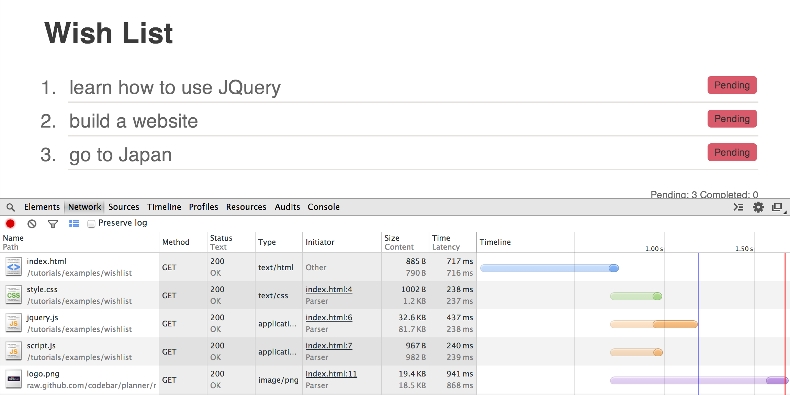

### Objectives

In this tutorial we are going to look at:

* The HTTP protocol
* APIs
* AJAX
* JSON
* Loading API data into web pages
* Using jQuery AJAX functionality

### Goal

By the end of this tutorial you will have built:

* A webpage that can retrieve information about a specified GitHub user
* A webpage that can show the upcoming schedule for BBC shows

# HTTP Requests

## What are HTTP Requests?

Every time the browser fetches data from a server (which could be a page, an image, a script etc) it does it using HTTP. HTTP is the **H**&#x200b;yper<strong>T</strong>ext **T**&#x200b;ransport **P**&#x200b;rotocol. The server then sends back a **response**. An API is an easy way of fetching information from a remote service, in a way that's easy for a computer to understand.

GitHub offers a [simple API](https://status.github.com/api) for viewing its current and historical server availability.

> Availability means whether or not the GitHub website was accessible to users and accepting traffic. If your website is down, it is not available.

You can access an API in your web browser. Just pop the following into the address bar:

    https://status.github.com/api.json

If you are on a mac or a linux/unix machine, you can access the API using curl:

    curl https://status.github.com/api.json

> Paste the following command into Terminal, which you can find in Finder - first go into the Applications folder, then Utilities.

Here is an example of the **GET** requests issued by the [wishlist tutorial](https://tutorials.codebar.io/examples/wishlist/index.html).

\*You can view any requests issued by a website by going to the Network (or Net) tab.



As part of the response, a request gives back a **status code**. You can use this to identify if the request was successful or not.

| Status code | Message | Description |
| ------------| ------- | ------------ |
|  200        |   OK    | Successful request |
|  304        |   Not modified    | The page has not been modified since we last retrieved data |
|  400        |   Bad Request | The server did no understand the request |
|  404        |   Not Found | The server could not find the requested resource |

### HTTP Verbs

HTTP verbs are sent by the browser or client, and along with the URL used and data transmitted form part of the instruction to the API. There are several verbs, but in this tutorial we will be primarily using GET. GET is used to fetch information from an API. Another common verb is POST, which is used to create a new object on the remote service.

## Exercise 1 - Retrieve GitHub user information

We'll build a small application that gives us back information about a GitHub user - we want to show their username, information and their picture. [Download](https://gist.github.com/deniseyu/d1bc03b8091153b4b1a7/download) the exercise files or clone them directly from Github `https://gist.github.com/deniseyu/d1bc03b8091153b4b1a7`

GitHub offers an API where you can request information for a given username. The verb to use is GET, and the url is `https://api.github.com/users/<username>`. For codebar, this would be: `https://api.github.com/users/codebar`. Again, to request this you can use curl:

    $  curl -XGET https://api.github.com/users/codebar

or, as GET is the default verb, just:

    $ curl https://api.github.com/users/codebar

Again, you can simply access this URL in your web browser by inserting `https://api.github.com/users/codebar` into the address bar.

The response will look something like the JSON data below, which we have shortened:

```json
{
  "login": "octocat",
  "id": 1,
  "avatar_url": "https://avatars.githubusercontent.com/u/9906?v=2",
  "gravatar_id": "",
  "html_url": "https://github.com/octocat",
  "type": "User",
  "name": "monalisa octocat",
  "company": "GitHub",
  "blog": "https://github.com/blog",
  "location": "San Francisco",
  "email": "octocat@github.com",
  "bio": "There once was...",
}

```

This data is what's called key value pairs, meaning that the name of the field is displayed immediately before the value. As you can see, the URL for the avatar (user's icon) is in the `avatar_url` field, and is `https://avatars.githubusercontent.com/u/9906?v=2`.

### Getting started

First, open the HTML page supplied in the download. As you can see, there is a box to type in a username. When the user has typed in the username, they should be able to trigger the API call to GitHub by pressing \<enter\>.

The following code allows you to listen for a keypress on the input field, and to see if it was the \<enter\> key that was pressed.

```js
$(document).ready(function() {
  $(document).on('keypress', '#username', function(event) {
    if (event.which === 13) { // check the key was <enter>
      // do something
    }
  });
});
```

We will need to pass the username to GitHub, so we need to extract it from the input text box. To show that we can do this - let's first extract the data using jQuery's `val()`, and log it to the console. Something like this should work:

```js
$(document).ready(function() {
  $(document).on('keypress', '#username', function(event) {
    if (event.which === 13) { // check the key was <enter>
      var input = $(this);
      var username = input.val();

      console.log('username was: ' + username);
    }
  });
});
```

Now we're ready to pass this through to GitHub. Let's make another function, something like this:

```js
function getGithubInfo(username) {
  var url = 'https://api.github.com/users/' + username;

  var xmlhttp = new XMLHttpRequest();
  xmlhttp.open('GET', url, false);
  xmlhttp.send();

  var data = xmlhttp.responseText;

  console.log(data);
}
```

`XMLHttpRequest` is the object we use in JavaScript to perform an HTTP or API request. Although it has `XML` in the name (XML is a data format), it can be used for other formats such as JSON, which is what we're using here.

We create an `XMLHttpRequest` object and then call the `open` method, passing three arguments to the GitHub API.

1. the `verb` - in this case, `'GET'`
2. the `url` - in this case the url eg https://api.github.com/users/codebar
3. whether or not to run this request synchronously or asynchronously.

In this case, we'll specify synchronously by passing `false`. This means the browser will wait for the call to the GitHub API to finish before continuing.

> Making requests synchronously is not good practice, but we're doing it for now to keep things simple. Your browser may show a deprecation warning but the request will still work. We'll move onto asynchronous requests further down once we have the basics of APIs covered.

You can now call `getGithubInfo`, passing the username, from the `keypress` block above. That will log the data to the console. Next, we need to pass this back to the web page via the DOM.


### Handling a successful request

Our `getGithubInfo` method will return the response from the server, including the HTTP status:

```js
function getGithubInfo(username) {
  var url = 'https://api.github.com/users/' + username;

  var xmlhttp = new XMLHttpRequest();
  xmlhttp.open('GET', url, false);
  xmlhttp.send();

  return xmlhttp;
}
```

If the request was successful, the status code will be 200. If we check that this code is 200, we know we can proceed to reading the data.

Create a new method called `showUser()` that handles the response from the API, and performs this check on the `xmlhttp` variable we just returned from our `getGithubInfo` method. Once the `keypress` block has called `getGithubInfo`, it should pass the result to `showUser`.

```js
function showUser(xmlhttp) {
  if(xmlhttp.status === 200) {
    // show the user details
  } else {
    // show an error
  }
}
```

Once we've checked the status, we need to decode the data which is stored in `xmlhttp.responseText`. It's in [JSON](http://www.json.org/) format, which is a string, so we need to turn that into a native JavaScript object. We do this using `JSON.parse(data)`.

```js
function showUser(xmlhttp) {
  if(xmlhttp.status === 200) {
    // show the user details
    var json = xmlhttp.responseText;
    var user = JSON.parse(json);
  } else {
    // show an error
  }
}
```

Now the `user` variable will contain all the information we need to update the page. Finish the function to:

1. Display the user's Github id in `#profile h2` - `<user login> + ' is GitHub user #' + <user id>`
2. Add a link to the user's Github profile in `#profile .information`. The link should have a class `profile`
3. Add an image in `#profile .avatar`. To do that, you can use the `avatar_url`
   from the response.


### Handling a failed request

First, let's make sure we handle any requests that have failed.

> Have a look in the status codes. There is only one response code for a successfully request, anything else should be classed as a failure.

When we have a failing request, we want to change the `html` of `$('#profile h2')` to `No such user!`

Try this out using username: `iamcodebar` (or if someone registered this, make up a random string)


### Bonus!

Well done, you've finished! For a bonus, switch your `getGithubInfo` method to run asynchronously - your coach can help you.

> Coach... explain the difference between synchronous and asynchronous requests. There's a good explanation on [Mozilla Developer Network (MDN)](https://developer.mozilla.org/en-US/docs/Web/API/XMLHttpRequest/Synchronous_and_Asynchronous_Requests)


## ~~Exercise 2 - BBC's tomorrow's TV schedule~~


**Part 2 of this exercise is no longer possible as the API that it uses has been taken down by the BBC.**  
**Sorry, we're working on fixing the exercise!**

[Download](https://gist.github.com/despo/05cab2f0b38bc02318e7/download) the exercise files or clone them directly from github `git clone https://gist.github.com/05cab2f0b38bc02318e7.git`

For the second exercise, we will build an application that retrieves tomorrow's TV schedule for each genre using BBC's API.

### What we will be doing:

1. Retrieve and render available genres using `http://www.bbc.co.uk/tv/programmes/genres.json`

2. Write a function that retrieves tomorrow's TV schedule using a genre `http://www.bbc.co.uk/tv/programmes/genres/<genre>/schedules/tomorrow.json`

3. Write a function that displays each programme

4. **Bonus** Retrieve all upcoming episodes of a programme

### Request using jQuery

This time, let's use jQuery's `ajax()` method. Things are a bit easier when using jQuery as we can create different code blocks that handle successful or failed requests.

Also, jQuery isolates us from the differences between browser implementations of AJAX calls (for example, if we wanted to make the previous AJAX call work in Internet Explorer,  we will have to write [a much longer method](http://www.tutorialspoint.com/ajax/ajax_browser_support.htm)!)

```js
$.ajax({
  url: request_url,
  dataType: 'json',
  beforeSend: function() {
   // do something before running the request
  }
}).done(function(data) {
  // process data
}).fail(function() {
  // code
}).always(function() {
  // code that runs regardless of request succeeding or failing
});
```

`datatype` defines the type of result we will be getting back. This avoids us having to parse the response to JSON.

`beforeSend` can be used if we need to perform something before running the request.

`.done()` handles a response that returns a success status code

`.fail()` is called when the request fails


## Retrieving and displaying all available genres

Write a function `retrieveGenres()` that does an AJAX call to the API.

```javascript
function retrieveGenres() {
  // AJAX call using jQuery that retrieve and process the result
}
```
> Try logging the resulted data and have a look in the console to see and explore the created objects

> `<key>` is the genre format we need to retrieve results from the API

> You can use `<title>` to display a humanly readable format of the Genre

As you can see from the console, the resulting objects are returned inside an Array. We want to iterate over the list using the native Array `forEach( )` function and add each item to the `#genres` list, as a **list item**. As we need to have access to the `key` as well, we can set that as the list item's `id`.

Now that we have all the available genres, we can move on to making calls to the API using the genre to retrieve tomorrow's schedule!!

## Retrieve schedule

Now, let's create a function that retrieves films using genre.

```javascript
function getTomorrowsSchedule(genre) {
  // call to retrieve TV schedule
}
```

The response you get back should look similar to this, with multiple objects in the broadcasts array.

```json
{
  "broadcasts": [
    {
      "is_repeat": false,
      "is_blanked": false,
      "schedule_date": "2014-01-15",
      "start": "2014-01-15T00:10:00Z",
      "end": "2014-01-15T01:50:00Z",
      "duration": 6000,
      "service": {
        "type": "tv",
        "id": "bbc_one",
        "key": "bbcone",
        "title": "BBC One",
        "outlets": [
          {
            "id": "bbc_one_wales",
            "key": "wales",
            "title": "Wales"
          },
          {
            "id": "bbc_one_wales_hd",
            "key": "wales_hd",
            "title": "Wales HD"
          }
        ]
      },
      "programme": {
        "type": "episode",
        "pid": "b00sbk03",
        "position": null,
        "title": "Disturbia",
        "short_synopsis": "Thriller about a high school student convinced that his neighbour is a serial killer.",
        "media_type": "audio_video",
        "duration": 6000,
        "image": {
          "pid": "p01gqbj3"
        },
        "display_titles": {
          "title": "Disturbia",
          "subtitle": ""
        },
        "first_broadcast_date": "2010-05-03T22:30:00+01:00",
        "ownership": {
          "service": {
            "type": "tv",
            "id": "bbc_three",
            "key": "bbcthree",
            "title": "BBC Three"
          }
        },
        "is_available_mediaset_pc_sd": false,
        "is_legacy_media": false
      }
      }]
    }
```

To process the response, we want to iterate over the `response.broadcasts` array and add each item, to `#programmes` as a list item.

To make this a bit easier, this is how you can access the values we need:

* `item.programme.display_titles.title`
* `item.programme.short_synopsis`
* `item.programme.image.pid` _only if `item.programme.image` is set_
* `item.start` and `item.end`
* `item.duration`
* `item.service.title`

It would be easier to use string concatenation to construct the html, before appending each item to the list.
Also, to make your code easier to read, try constructing the html in a method that you pass the response object.

```javascript
function processEpisode(episode) {
  var item_html = '<li>';
  item_html += '<h2>' + episode.programme.display_titles.title + '</h2>';
  // display short short synopsis
  // display image
  // display date and time
  // display duration (HINT: the duration is in seconds, convert that to minutes)
  // display the channel (or service, as its called by the API) - add this in a span with the class `service`
  ...
}
```

> To display the date formatted correctly, you can use the `formatDate( )` function as we won't be going into details about dates in this tutorial. If you want to know how it works, try going through the code and ask your coach any questions you have.

To display an image for a programme, we need to use `.jpg />`.  As not all programmes have an image, we can use an image placeholder when no image is set ``

### Binding the call to the click event

Handle a `click` event on `#genres li` and make a call to `getTomorrowsSchedule(genre)`

### Improving our function

To make the genre we have just clicked active, we also want to add the CSS class `active` to the element that the event has been triggered from.  Don't forget to remove the class `active` from any other `#genres li` items.

> Did you remember to commit your changes?

### Using `beforeSend`

Every time we issue a call to the API, we want to clear the `#programmes` list. We can do that using `empty()`.
Also, as some of the requests take a while, we want to display a spinning image `<div class='spinner'></div>`.

> Don't forget to remove the spinner, when the request is completed successfully.

## Bonus: Retrieving all upcoming episodes of a programme

To get back all the upcoming shows for an episode, we need to utilise the programme pid, that we can retrieve from the response using `episode.programme.programme.pid`. The URL for the request is `http://www.bbc.co.uk/programmes/<pid>/episodes/upcoming.json`

> **Hint:** The programme `pid` is only available if `episode.programme.position` is set.


```javascript
function getUpcomingEpisodes(pid) {
  // AJAX call to retrieve upcoming episodes
}
```
Since the response structure is similar to the one for retrieving tomorrow's schedule, we should be able to re-use the `processEpisode( )` function to display each item from the broadcasts array.

Handle the `click` event to retrieve and display the upcoming episodes!

Here is our version of the [tv schedule app](../../examples/tv-schedule/index.html).

---
This ends our **HTTP Requests, AJAX and APIs** tutorial. Is there something you don't understand? Try and go through the provided resources with your coach. If you have any feedback, or can think of ways to improve this tutorial [send us an email](mailto:feedback@codebar.io) and let us know.
