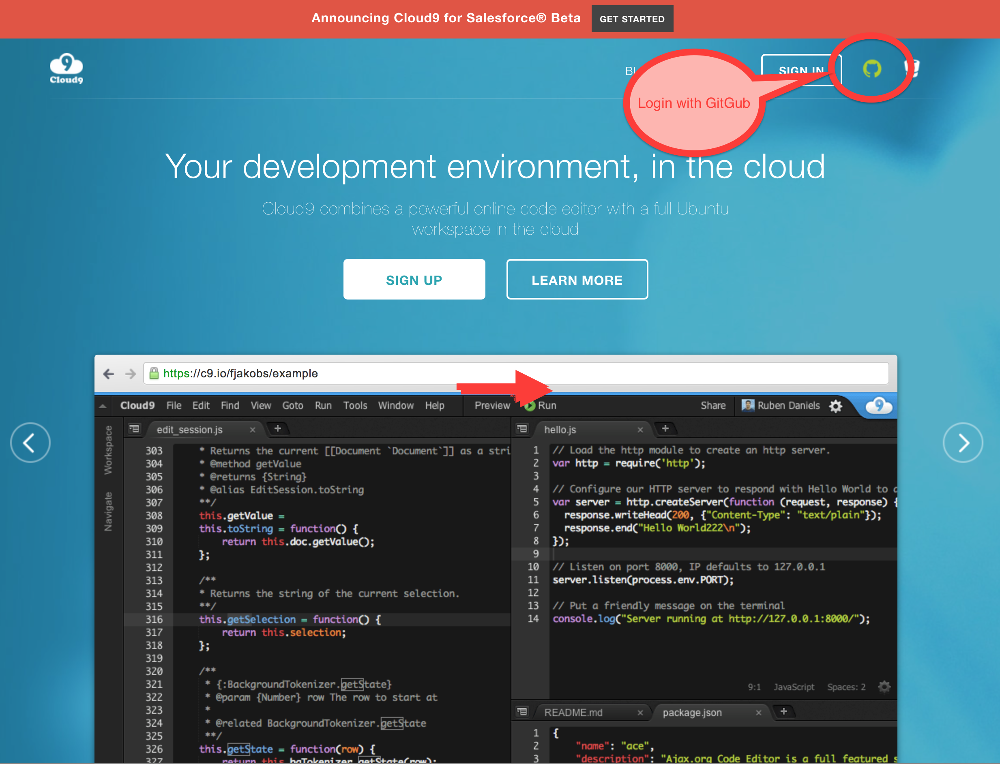
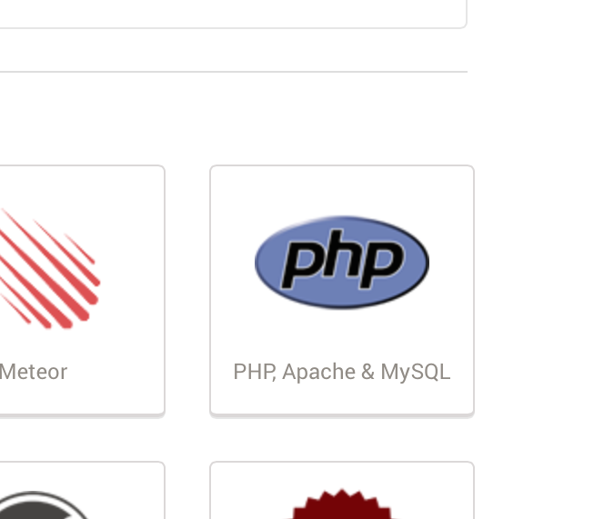
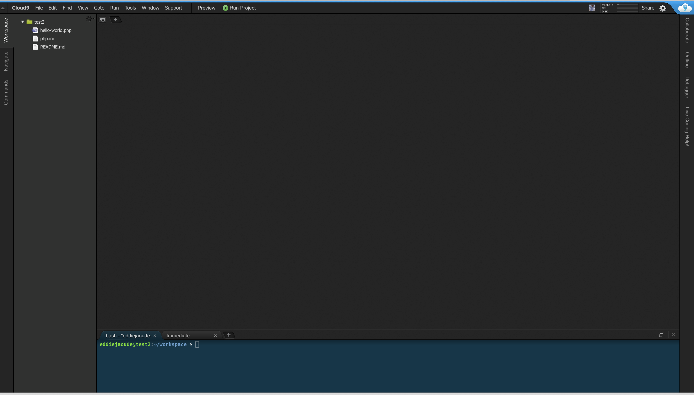
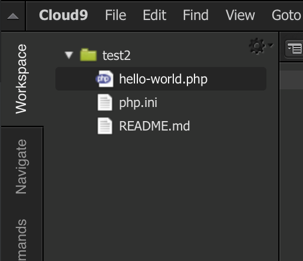
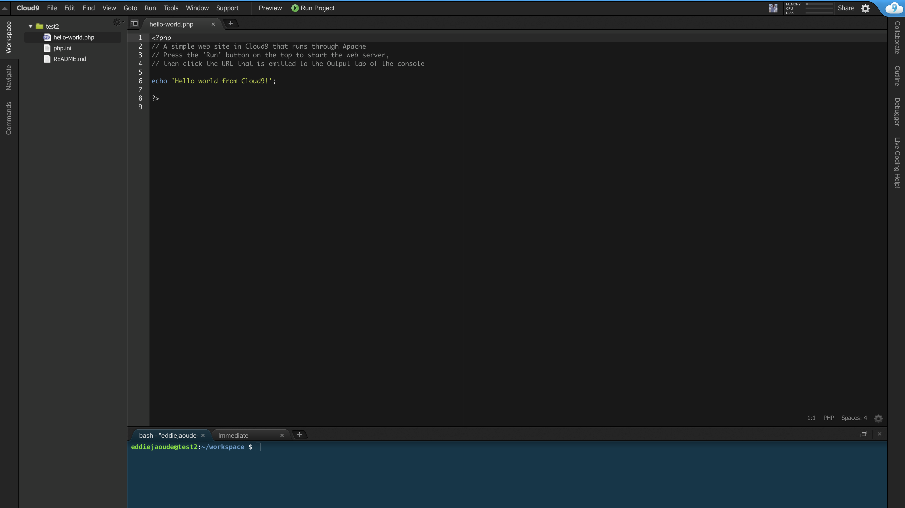
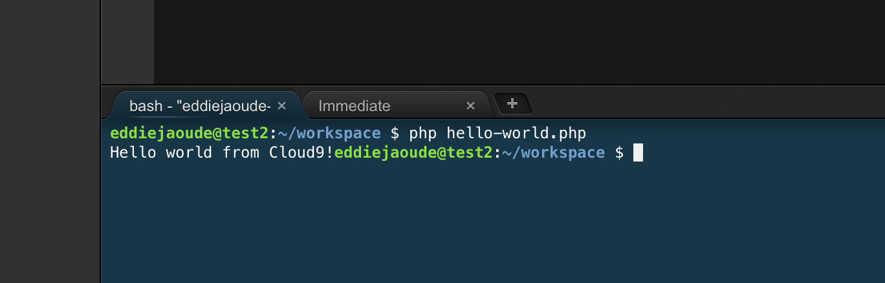
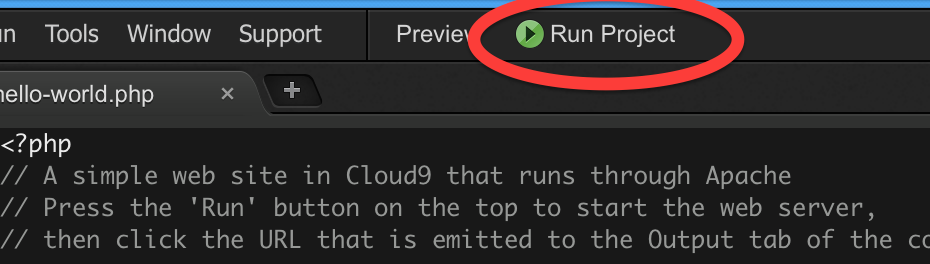
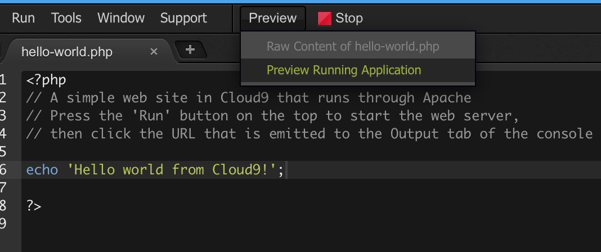
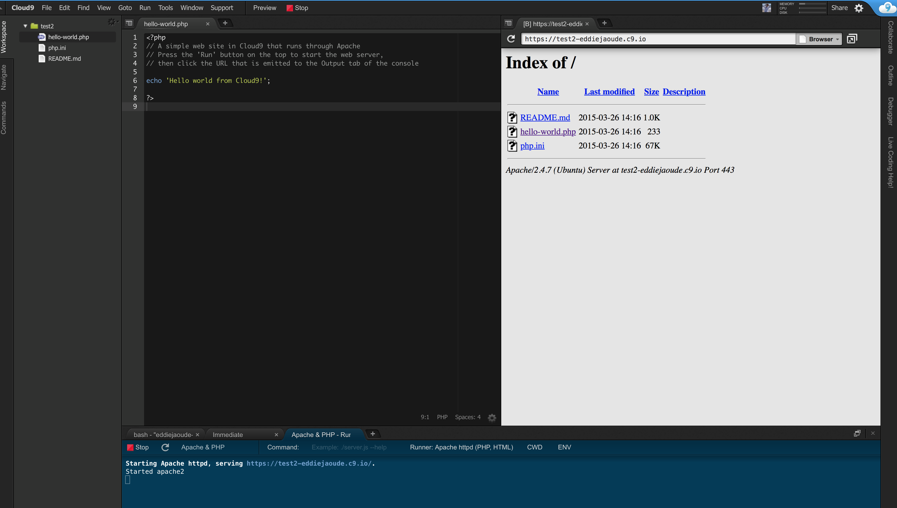

##### Requirements

* 15 minutes
* Internet connection and a modern browser

*Note: Free for small projects*

##### Achievements

By the end of this tutorial you will be able to:

* run PHP in your browser from any computer in the following manner:
    * Command Line (CLI)
    * Browser

---

If you want to have a go with **PHP** but do not wish to setup a local environment on your laptop, one can use an online IDE to write PHP.

## Setting up the Web based IDE to write PHP

* 1. In a modern browser visit the url `https://c9.io`

* 2. Login with your GitHub credentials as shown in the image below

Then you should see your **Workspaces**

* 3. Click on the `+` to create a new **Workspace**

* 4. Fill in your details: project name, description etc

In the last section **Template**, choose **PHP**

* 5. Then press **Create**

Give it a minute to load, especially for the first time.

Then you should have something like this

## In the Web based IDE

Now your **Workspace** has been created, you will have an example **PHP** script listed on the left, called `hello-world.php`.

Double click this file and it will open in the *main window* which is on the right of the file list.

## Running the PHP code

The **PHP** code can be run in two ways, the **CLI** or in the **Web Browser**

### Running the PHP code in the CLI

* 1. Go to the bottom window that has your `yourname@yourprojectname:~/workspace`

* 2. Type `php hello-world.php` and press **enter**.

You should see the output `Hello world from Cloud9!`

### Running the PHP code in the Browser

* 1. Run the project webserver

Click on **Run Project**

The button will now change to **Stop**

* 2. Click **Preview**, then **Preview running application**

This will now show a file list in the built-in browser

* 3. Click on `hello-world.php` to run the script

Now in the built-in webserver you will see the same output as the CLI from earlier `Hello world from Cloud9!`

---

Now change the PHP code and repeat! Enjoy.
