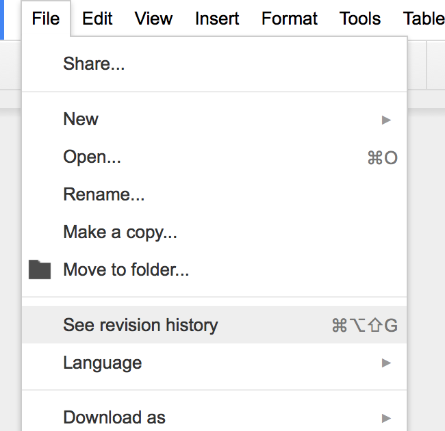
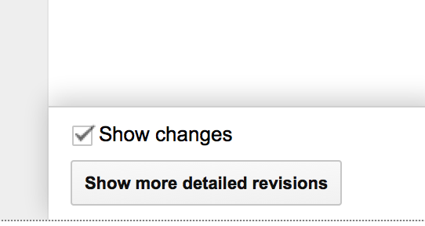
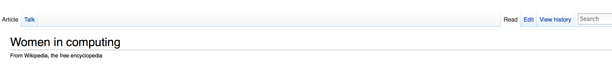
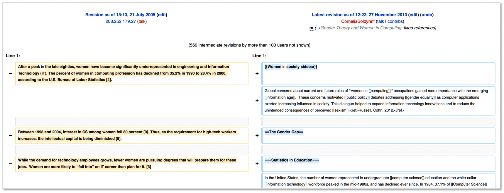
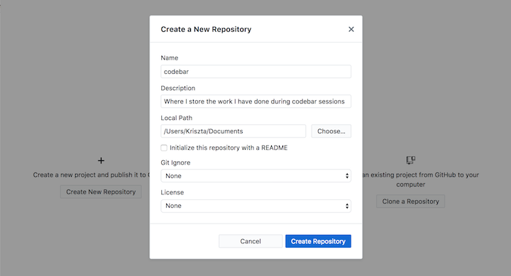
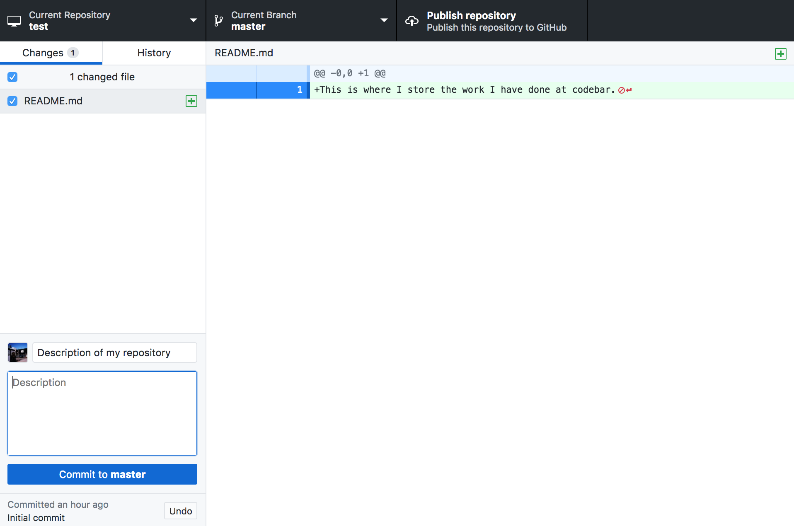
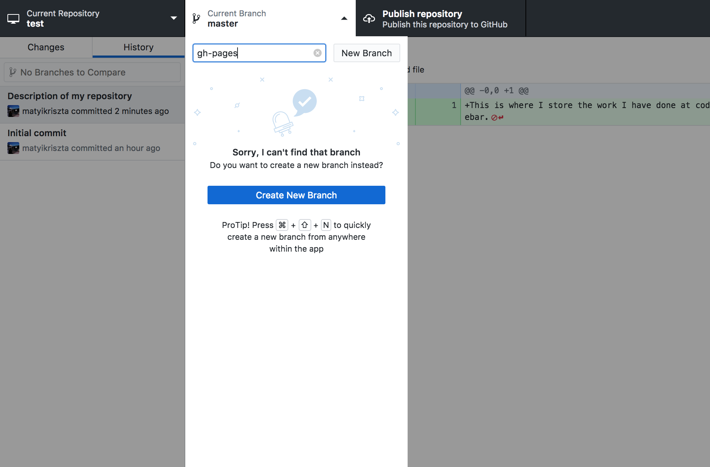
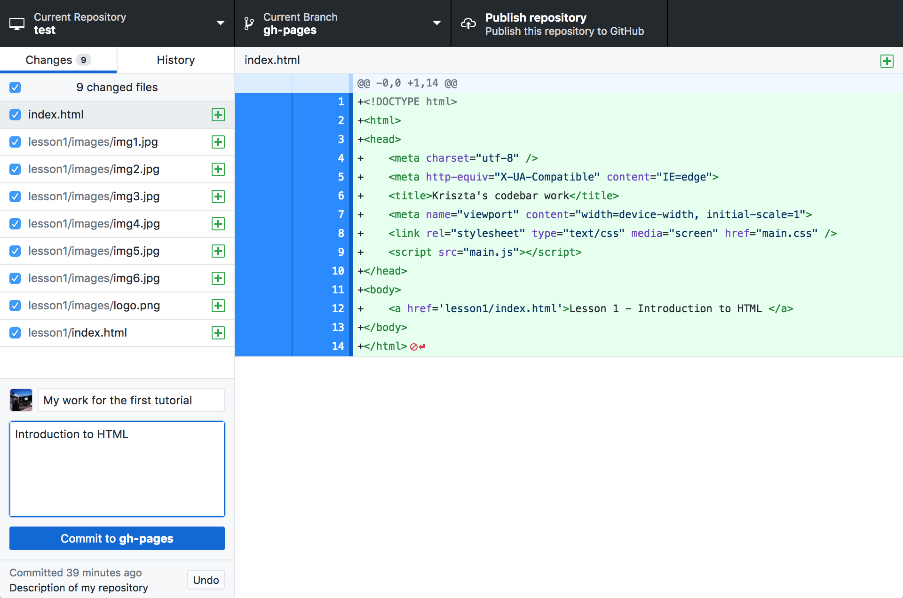
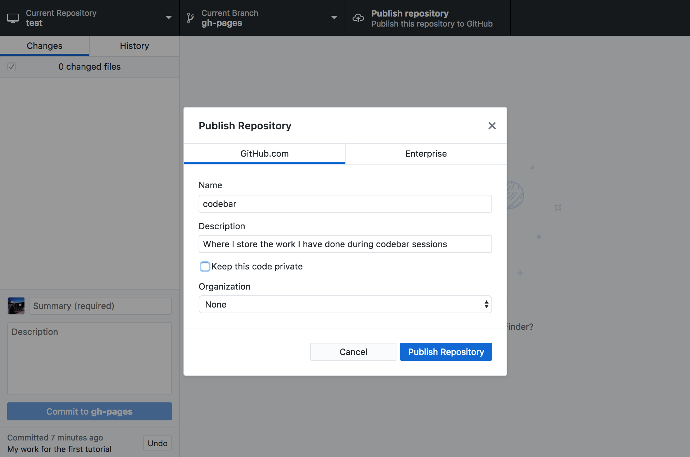

## What is version control?

Version control is a way to manage and track any changes you make to your files. 

### Google docs revision history

Google docs, for example, keeps a revision history of any document you create and modify.

Have a look [at this Google document](https://docs.google.com/document/d/10kHJKXHLa-V8G6vVQoDiS6cTPvJoXnj_-SDvfQdziFk/edit?usp=sharing).

- Select to see the revision history (you must be logged in with your Google account to do that!)



- And the more detailed version



Scroll through the revisions, from the bottom up. You should be able to see each set of changes highlighted in green.

### Wikipedia page history

Wikipedia also holds a history of all changes.
- Go to [this document](https://en.wikipedia.org/wiki/Women_in_computing)
- Click **view history**



- Try and have a look at the first revision of the page, by going back. It's dated back to 2005!
- Click **curr**, that will show you the [differences between the first and the latest entry](https://en.wikipedia.org/w/index.php?title=Women_in_computing&diff=583521812&oldid=19298328)



## Why do you need Version Control?

- When used on a regular basis, version control helps you to store your files safely. It makes it easy to figure out what broke your code as you can roll back to a previous version and work out when things last worked as expected.

- It is also helpful when working with other people as it combines all the changes together, and tracks who, why and when it changed.

## Code version control systems

There are a number of different version control systems. The most popular ones are **svn** (or Subversion), **cvs**, **mercurial** and **git**.

We will be using **git**.

### Why Git?

There are a number of reasons we chose git. To name some

- A lot of learning resources

- Does not require you to be connected to the internet to use

- All your tracked changes stay on your machine until you are happy with them, and want to make them part of your codebase

- Will tell you if someone has made changes since you last pushed code and urge you to update first and resolve issues

- Github and online collaboration. Open source code is a big part of today's life. By being able to retrieve and help existing projects, you can also contribute to them

Some popular project using git:

- Android

- Linux

- Python

- Ruby

- PHP

# A bit more about Git

## Terminology

- repository: A repository is where code is stored

- checkout: When you retrieve code from a **repository**

- commit: Applying any changes you have made to the **repository**

#### Aim for small and focused changes

When using version control, you should commit every time you do a small piece of work, rather than working for hours in a row, changing too many things and then committing them.

For example, if you want to change the position of an element, the color of all the links on your page and the font size dimensions of all paragraphs, you should do three commits, using messages that describe what you are doing each time.

### Bad commit messages

Every time you commit a change use a message that describes your change clearly. In a few months time you will have difficulty remembering why you applied a change if your messages say _changing some CSS_, _another commit_, or _more changes_

Try using messages like _repositioned image to look better on page_, _resolved positioning issue for Firefox_.

# The next step!

Sign up to [Github](https://github.com/)

Download [Github Desktop](https://desktop.github.com/) (for Mac or Windows).

## Now what?

Now that you have the Github client setup on your machine, we will spend some time adding what you have created in the HTML & CSS lessons on the internet! Before you start make sure the Github client is running and you are signed in.

1. Create a new repository by clicking the Create New Repository button

	

2. Open the directory you just created in your text editor and create a README.md file with the following content:

	_This is where I store the work I have done at codebar._

3. Go back to the Github client and commit the file by filling out the Summary field and hitting the Commit to master button
	
	

4. Now, create a new branch called **gh-pages**

	

5. In the directory, create a subdirectory **lesson1** and move the **html** file you created at the first session and all the other relevant files and directories (e.g. /images)

6. Now, link the file from the root of your project by creating an `index.html` file and adding a link to the page

	```
	<a href='lesson1/index.html'>Lesson 1 - Introduction to HTML </a>
	```
	> Don't forget to rename index to whatever you have named your file!

7. Commit your changes to the gh-pages branch

	

8. Once you committed your changes publish your work by clicking the **Publish repository** button

	

9. View your work on the internet!

	To access your work, go to `http://<username>.github.io/codebar`

10. Repeat the process to list the rest of the tutorials you have worked on on the page as well.

## Bonus

This is your personal page. Use what you learned in the previous lessons to style it, make it look pretty, and what we learned today to commit and publish your changes.

-----

This ends our _Introduction to version control and git_ lesson. Is there something you don't understand? Try and go through the provided resources with your coach. If you have any feedback, or can think of ways to improve this tutorial [send us an email](mailto:feedback@codebar.io) and let us know.
